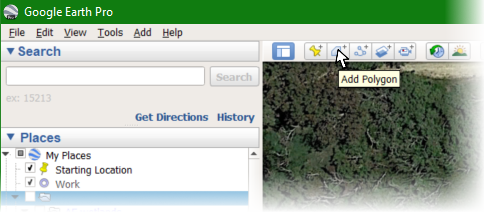

<style type="text/css">
  body{
  font-size: 12pt;
}
</style>

```{r load-packages-invisibly, message=FALSE, warning=FALSE, include=FALSE}
library(sf)
library(maptiles)
```

# Introduction

Sometimes it's useful to add manually digitised information to maps. For
example, seasonal ponds are not always shown on map tiles from providers such as
[OpenStreetMap](https://www.openstreetmap.org/){target="_blank"} or
[Stamen](https://stadiamaps.com/explore-the-map/#map=11.54/-34.9942/117.3697&style=stamen_terrain){target="_blank"}. While this can be overcome by
using a map background made from aerial photograph tiles, we can often present
our environmental data from sampling more clearly using graphics-based map tiles
which do not include every detail of the land surface.

One way to quite easily get coordinates for map features is to use the drawing
tools in the Google Earth app.

## Using the polygon tool in Google Earth to digitise and save map features

In this context, *digitise* means nothing more than converting part of an image
to numeric coordinates. The following set of instructions outlines a process we 
can use to save an irregular polygon shape from 
[Google Earth Pro](https://www.google.com/earth/versions/){target="_blank"} 
(a free download, so it's very accessible, or there is a 
[web version](https://earth.google.com/web/){target="_blank"}).

1. Open Google Earth, and find the feature you want to digitise.

2. Click the polygon tool in the toolbar <br>

3. Give the feature a name <br>

4. Choose and click on the starting point <br>

5. Click all the points you need to create your polygon <br>

6. Click `OK` in the `New polygon` dialog <br>

7. Your polygon will be visible in the `▾Places` pane of the Google Earth app. Opposite-click and select `Save Place As...` <br>

8. In the `Save file...` dialog, under `Save as type:`, select `Kml (*.kml)`, and save into your current R working directory.<br>

### Creating a KML file in the web version of Google Earth:

1. On your computer, open [Google Earth](https://earth.google.com/web/){target="_blank"}.
2. On the left, click Projects.
3. Click **New project**.
4. Click **Create KML File** » **Add to project**.
5. Select "Add placemark," "Draw line or shape," or "Fullscreen slide."
6. A KML file is saved in your computer's browser storage.

&nbsp;

# Converting the saved `.kml` files for use in R

The `sf` package function `st_read()` can handle many types of input file, 
including Google Earth `.kml` files.

```{r}
library(sf)
Lake1_sf <- st_read("https://github.com/Ratey-AtUWA/spatial/raw/main/Lake1.kml")
st_coordinates(Lake1_sf)[1:10,]    # just the first 10 rows
```

## Using the saved and converted `.kml` data on a map

The map at the end (Figure 1) uses the polygon coordinates saved in the steps
above to draw a polygon object on a `maptiles` map background, after conversion 
using the `st_transform()` function from `sf`. The `OpenStreetMap` tiles used do 
not show the seasonal ponds visible on Google Earth, so adding manually 
digitised map features makes sense.

```{r read-lake1, results='hold'}
UTM50S <- st_crs(32750)
Lake1_sf <- st_transform(Lake1_sf, crs = UTM50S)   # convert to UTM Zone 50S
st_coordinates(Lake1_sf)[1:10,]                    # just the first 10 rows
```

```{r plot-Lake, fig.cap="Figure 1: Plot of 'Lake1' feature shown in Google Earth digitisation steps above.", fig.height=6, fig.width=8.75, message=FALSE, warning=FALSE, out.width="70%", results='hold'}
library(maptiles)
extent <- st_as_sf(x = data.frame(x = c(399860,400520), y = c(6467920,6468350)),
                   coords = c("x","y"), crs=UTM50S)
aftiles <- get_tiles(extent, provider="OpenStreetMap", crop=TRUE, zoom=17)
par(mar=c(3,3,1,1), mgp=c(1.5,0.2,0), tcl = -0.2, font.lab=2, 
    lend = "square", ljoin = "mitre", lheight=0.85)
plot(st_coordinates(extent), asp=1, xaxs="i", yaxs="i", type="n",
     xlab="Easting", ylab="Northing")
plot_tiles(aftiles, add=TRUE) ; box()
plot(Lake1_sf[1], add=TRUE, border="steelblue", col="#B0C0FF80", lwd=2)
text(st_coordinates(st_centroid(Lake1_sf)),
     labels = "Lake 1", col="steelblue", cex=1.25, font=2)
legend("bottomright", box.col="transparent", bg="#ffffffb0",
       legend="UTM Zone 50 South, Datum = WGS84 (EPSG:32750)",
       y.intersp=0.7, cex=0.8)
```

# Packages

Giraud T (2022). *maptiles: Download and Display Map Tiles*. R package version 0.4.0, [https://CRAN.R-project.org/package=maptiles](https://CRAN.R-project.org/package=maptiles){target="_blank"}.

Pebesma, E., 2018. Simple Features for R: Standardized Support for Spatial Vector Data.   *The R Journal* **10** (1), 439-446, [doi:10.32614/RJ-2018-009](https://doi.org/10.32614/RJ-2018-009){target="_blank"}
