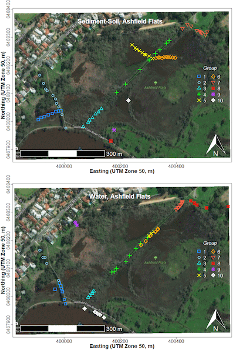

<style type="text/css">
  body{
  font-size: 12pt;
}
</style>

```{r addimg function, include=FALSE}
library(png)
addImg <- function(obj, x = NULL, y = NULL, width = NULL, interpolate = TRUE){
  if(is.null(x) | is.null(y) | is.null(width)){stop("Must provide args 'x', 'y', and 'width'")}
  USR <- par()$usr ; PIN <- par()$pin ; DIM <- dim(obj) ; ARp <- DIM[1]/DIM[2]
  WIDi <- width/(USR[2]-USR[1])*PIN[1] ;   HEIi <- WIDi * ARp 
  HEIu <- HEIi/PIN[2]*(USR[4]-USR[3]) 
  rasterImage(image = obj, xleft = x-(width/2), xright = x+(width/2),
            ybottom = y-(HEIu/2), ytop = y+(HEIu/2), interpolate = interpolate)
}
```

<div style="border: 2px solid #039; padding: 8px;">
<p style="text-align:center; font-size:12pt;">
<em>Maps / spatial pages</em>: [Maps](maps.html){style="color:#04b;"} | 
[Spatial statistics](spatial.html){style="color:#04b;"} | 
[Spatial interpolation](spat-interp.html){style="color:#04b;"}</p>
</div>

&nbsp;

<div style="border: 2px solid #039; background-color:#fec; padding: 8px;">
<p style="text-align:center; font-size:12pt;">
**UWA Students**: <a href="#TandL">Go here for Learning Objectives and suggested activities on this page</a></p>
</div>

&nbsp;

# Introduction

We prepare maps for environmental reporting for two main reasons:

1. To show the site being investigated in its context, such as site
boundaries, surrounding land use, potential broader sources of
contamination, proximity to receiving environments, and so on. This is 
called a &ldquo;*Locality Map*&rdquo;.

2. To show the relevant details of the site being investigated:
relevant infrastructure, specific suspected sources of contamination,
sample types and locations, samples with contaminant conentrations
exceeding guideline values, *etc*. This is 
called a &ldquo;*Site Plan map*&rdquo;.

This page presents a simple workflow to prepare both Locality and Site 
Plan maps using relevant packages in R.

### Load the R packages we need for plotting maps (install first if needed)

Install the required packages to your device if you don't have them
already (**only do this once**, not every R session):

```{r install-if-absent, eval=FALSE}
if(!require(sf)) install.packages("sf")
if(!require(maptiles)) install.packages("maptiles")
if(!require(prettymapr)) install.packages("prettymapr")
if(!require(TeachingDemos)) install.packages("TeachingDemos")
if(!require(viridis)) install.packages("viridis")
```

You will need to load the installed packages each time you start
RStudio.

```{r setup, results='hide', warning=FALSE, message=FALSE, echo=-7}
library(sf)            # essential for maps and spatial analysis in R
library(maptiles)      # for downloading map tile images
library(prettymapr)    # for making north arrow and scale bar
library(TeachingDemos) # for shadowtext() function (outlined text)
library(viridis)       # for accessible colour palettes
palette(c("black", viridis(8), "royalblue", 
          "white", "transparent", "firebrick", "grey44")) # custom colours
secret <- read.csv("../StadiaMaps-API.csv")[1,1]
```


### Read some external data for adding info to maps

This code uses some functions from the `sf` R package( )Pebesma, 2018) 
to import some data from `.kml` files (Google Earth format), and 
transform the resulting spatial `sf` objects to the projection we are 
using. For more detail on the `sf` package, map projections, *etc*., 
look at [the Introduction to Maps in R page](maps.html){style="color:#04b;"}.

The `st_read()` function can import data from numerous formats such as
ESRI shapefiles and Google Earth `.kml` files. The `st_transform`
function converts the longitude-latitude coordinates in the `.kml`
files (units of degrees) to the coordinate reference system (CRS)
specified by the function `st_crs()` called within `st_transform`. The
CRS is specified by the 
[EPSG code](https://epsg.io/){target="_blank"}, where `32750`
indicates UTM Zone 50&nbsp;S based on the WGS84 datum, with units of
metres.

```{r read-external-data, results='hide', warning=FALSE, message=FALSE}
git <- "https://github.com/Ratey-AtUWA/Learn-R-web/raw/refs/heads/main/"

LC_site <- st_read(paste0(git, "LC_UWA_study_area.kml"))
LC_site <- st_transform(LC_site, crs=st_crs(32750)) # convert to UTM Zone 50S

Claremont_drains <- st_read(paste0(git, "Town-of-Claremont-Drains.kml"))
(Claremont_drains <- st_transform(Claremont_drains, 
                                 crs=st_crs(32750))) # convert to UTM Zone 50S
```

&nbsp;

# LOCALITY MAP

Australian guidelines for reporting on contaminated site investigations (NEPC
2011, DWER 2021) specify including a locality map "...showing site location,
site boundary, cadastral boundary or boundaries, surrounding area and any key
nearby features..." (DWER, 2021).
 
The first part of this code shows a method for producing a locality map in R,
relying on the `sf` spatial R package (Pebesma and Bivand, 2023) together with
the packages `maptiles` (Giraud, 2024) and `prettymapr` (Dunnington, 2024).

### next define a rectangle for a locality map

Find coordinates by:

- locating the bottom-left and top-right corners of the desired
  rectangle using the maps at the EPSG site
  ([https://epsg.io/map](https://epsg.io/map){target="_blank"} &ndash;
  make sure the Coordinate system at the bottom is changed to EPSG:32750).
- using Google Earth with ⊙ Universal Transverse Mercator
  selected under `Show Lat/Long` after clicking Tools/Options... ,
  then Add Placemark 📌

&nbsp;

**⚠ THESE COORDINATES 👇 ARE NOT REAL! - PLEASE FIND YOUR OWN!**

```{r eval=FALSE}
locality <- st_as_sf(data.frame(x=c(123456,123456), y=c(1234567,1234567)),
                     coords=c("x","y"), crs=st_ evalcrs(32750))
locality # check it worked: should include 'Projected CRS: WGS 84 / UTM zone 50S'
```

```{r include=FALSE}
locality <- st_as_sf(data.frame(x=c(382000,386500), y=c(6460430,6462970)),
                     coords=c("x","y"), crs=st_crs(32750))
locality # check it worked: should include 'Projected CRS: WGS 84 / UTM zone 50S'
```

&nbsp;

### Use the `get_tiles()` function with options to download map tiles

The code above made an object `locality` which defined our map 
rectangle in our chosen coordinate system. The `locality` object then 
becomes an input for the `get_tiles()` function from the `maptiles` R 
package. We specify some other options as well: `provider=` sets the 
map tile style, and `zoom=` sets the level of detail. At each zoom 
level, map tiles are squares, so we use `crop=TRUE` to trim any 
unneeded parts of the map tile images.

```{r get-map-tiles, echo=-1, eval=-2}
claremontMap <- get_tiles(locality, provider="OpenStreetMap.HOT", crop=TRUE,
                          zoom=15, forceDownload = TRUE, cachedir="./maptilecache/")
claremontMap <- get_tiles(locality, provider="OpenStreetMap.HOT", crop=TRUE,
                          zoom=15)
```

&nbsp;

### Then plot the map

The best option for plotting seems to be to:

1. Plot an empty map frame based on the extent object (`locality`),
  adding axis labels and specifying `xaxs="i", yaxs="i"` to suppress
  axis padding.
  
2. Use the `plot_tiles()` function from the `maptiles` R package to 
  add the map tile layer. We include the option `add=TRUE` to plot on 
  top of the previous plot.

```{r plot-base-locality-map, fig.width=8.2, fig.height=5, fig.cap="Figure 1: Georeferenced map tile image obtained with the `maptiles` R package to use as a base locality map."}
# first setting graphics parameters with par()
par(mar=c(3,3,1,1), mgp=c(1.5,0.3,0), font.lab=2)
# first an empty plot frame based on the map extent
plot(st_coordinates(locality), type="n", asp=1, xaxs="i", yaxs="i",
     xlab="Easting", ylab="Northing")
plot_tiles(claremontMap, add=TRUE)
box() # redraw plot frame
```

&nbsp;

After plotting the map in RStudio, you will probably need to adjust 
the size and proportions of your plot area manually, so that the map 
tiles fill the whole plot frame.

### Next, add the necessary map and plot features and annotations

The guidelines state that a North arrow and scale bar should be 
included on maps, as well as the locations of significant geographical 
features (natural *or* anthropogenic).

```{r add-map-annot, echo=-1, fig.width=8.2, fig.height=5, message=FALSE, warning=FALSE, fig.cap="Figure 2: Georeferenced map tile image obtained with `maptiles`, with `prettymapr` north arrow and scale bar, and text annotations using the `shadowtext()` funtion from the `TeachingDemos` package."}
par(mar=c(3,3,1,1), mgp=c(1.5,0.3,0), font.lab=2); plot(st_coordinates(locality), type="n", asp=1, xaxs="i", yaxs="i", xlab="Easting", ylab="Northing"); plot_tiles(claremontMap, mar=c(3,3,1,1), add=TRUE); box()
# ...continuing code from above
addnortharrow()
addscalebar(plotepsg = 32750, pos="bottomleft", label.col = 1, linecol = 1,
            label.cex = 1.2, htin=0.15, widthhint=0.3, padin=c(0.15,0.25))
mtext("CRS:UTM Zone 50S, WGS84 (EPSG:32750)", side=1, line=-1.2, 
      font=2, col=14, cex=0.75, adj=0.02)
shadowtext(384350,6461820, labels="Lake\nClaremont", col=3, bg=11, cex=0.85, font=2)
shadowtext(385000,6461120, labels="Fremantle Railway", col=5, bg=11, cex=0.85, srt=25)
shadowtext(382900, 6462250, labels="Military\nFacility", col=5, bg=11, cex=0.85)
shadowtext(382100, 6462200, labels="Indian Ocean", col=3, bg=11, font=3, srt=90, cex=0.85)
```

&nbsp;

### Finally add the data we imported earlier, and a legend

We should always indicate the location of the site under investigation 
on our Locality Map. We also include stormwater drains on this map, 
since stormwater may affect water quality in Lake Claremont. Adding a 
legend helps readers with map interpretation.

```{r final-locality-map, echo=-1, fig.width=8.2, fig.height=5, message=FALSE, warning=FALSE, fig.cap="Figure 3: Georeferenced map tile image obtained with `maptiles`, with annotations as in Figure 2, and third-party data used to plot stormwater drain locations and show the extent of the study area."}
par(mar=c(3,3,1,1), mgp=c(1.5,0.3,0), font.lab=2); plot(st_coordinates(locality), type="n", asp=1, xaxs="i", yaxs="i", xlab="Easting", ylab="Northing"); plot_tiles(claremontMap, mar=c(3,3,1,1), add=TRUE); box(); addnortharrow(); addscalebar(plotepsg = 32750, pos="bottomleft", label.col = 1, linecol = 1, label.cex = 1.2, htin=0.15, widthhint=0.3, padin=c(0.15,0.25)); mtext("CRS:UTM Zone 50S, WGS84 (EPSG:32750)", side=1, line=-1.2, font=2, col=14, cex=0.75, adj=0.02); shadowtext(384350,6461820, labels="Lake\nClaremont", col=3, bg=11, cex=0.85, font=2); shadowtext(385000,6461120, labels="Fremantle Railway", col=5, bg=11, cex=0.85, srt=25); shadowtext(382900, 6462250, labels="Military\nFacility", col=5, bg=11, cex=0.85); shadowtext(382100, 6462200, labels="Indian Ocean", col=3, bg=11, font=3, srt=90, cex=0.85)
# ...continuing code from above
plot(Claremont_drains[1], add=TRUE, type="l", col=10, lwd=2)

plot(LC_site[1], add=T, type="l", col=13, lwd=3)

legend("topleft", bg="#ffffffa0", box.col=12, inset=0.02,
       legend=c("Lake Claremont study site",
                "Town of Claremont stormwater drains"),
       lwd=c(3,2), col=c(13,10))
```

&nbsp;

<hr style="height: 2px; background-color: #5560A4;" />

# SITE PLAN MAP

Australian guidelines for reporting on preliminary (PSI) and detailed (DSI)
site investigations (NEPC, 2011) also specify including a Site Plan drawn to a
scale appropriate to project size and required detail. This plan is
essentially a map showing features such as site boundary, sample locations,
actual installed locations of monitoring wells, boreholes and/or pits, and so
on (DWER, 2021). The Site Plan should also be used for reporting results,
including “… a clear representation of contamination issues associated with
the site…” (NEPC, 2011).

This section will explain the creation of such a more detailed Site map in R,
including information on potential contamination at discrete sampling points.

We already have an object `LC_site` that defines the boundaries of the site
so we can use that to specify the area of map tiles to download.
Note that we are choosing a different map tile style - the CartoDB tiles have
lighter colours, so are good for showing data on.

```{r plot-site-plan-map, fig.width=5.1, fig.height=7, message=FALSE, warning=FALSE, fig.cap="Figure 4: Site Plan map made with georeferenced tiles obtained with `maptiles`, with `prettymapr` north arrow and scale bar, and stormwater drains."}
LC_siteMap <- get_tiles(LC_site, provider="CartoDB.Voyager", crop=TRUE,
                          zoom=16)
par(mar=c(3,3,1,1), mgp=c(1.5,0.3,0), font.lab=2)
plot(st_coordinates(LC_site), type="n", asp=1, xaxs="i", yaxs="i", 
     xlab="Easting", ylab="Northing")
plot_tiles(LC_siteMap, add=TRUE)
box()
addnortharrow()
addscalebar(plotepsg = 32750, pos="bottomright", label.col = 1, linecol = 1,
            label.cex = 1.2, htin=0.15, widthhint=0.3, padin=c(0.15,0.2))
mtext("UTM Zone 50S, WGS84 (EPSG:32750)", side=1, line=-1.1, 
      font=2, col=14, cex=0.7, adj=0.98)
shadowtext(c(384450), c(6462180), labels=c("Rehabilitated bushland"),
           bg=11, col=6, srt=30)
shadowtext(c(384300,384650,384680), c(6461500,6461850,6461440), 
           labels=c("Scotch College\nsports fields","Grassed\nParkland",
                    "Golf\ncourse"), bg=11, col=c(14,6,6), font=3)
plot(Claremont_drains[2], add=T, type="l", col=4, lwd=1.5, lty=3)
```

&nbsp;

We need to read-in our data:<br />
(this is the same one used for the regression assignment &ndash; save it to your working directory in RStudio!)

```{r read-data-to-plot, eval=-2, echo=-1}
lcw24 <- read.csv("../ENVT4461/lcw24edit.csv")
lcw24 <- read.csv("lcw24edit.csv")
str(lcw24) # check it
```

We can optionally check sample locations (small `+` symbols):

```{r siteplan-sample-locations, echo=-1, fig.width=5.1, fig.height=7, message=FALSE, warning=FALSE, fig.cap="Figure 5: Site Plan map made with georeferenced tiles obtained with `maptiles`, with `prettymapr` north arrow and scale bar, stormwater drains, and locations of water samples."}
par(mar=c(3,3,1,1), mgp=c(1.5,0.3,0), font.lab=2); plot(st_coordinates(LC_site), type="n", asp=1, xaxs="i", yaxs="i", xlab="Easting", ylab="Northing"); plot_tiles(LC_siteMap, add=TRUE); box(); addnortharrow(); addscalebar(plotepsg = 32750, pos="bottomright", label.col = 1, linecol = 1, label.cex = 1.2, htin=0.15, widthhint=0.3, padin=c(0.15,0.2)); mtext("UTM Zone 50S, WGS84 (EPSG:32750)", side=1, line=-1.1, font=2, col=14, cex=0.7, adj=0.98); plot(Claremont_drains[2], add=T, type="l", col=4, lwd=1.5, lty=3); shadowtext(c(384450), c(6462180), labels=c("Rehabilitated bushland"), bg=11, col=6, srt=30);  shadowtext(c(384300,384650,384680), c(6461500,6461850,6461440), labels=c("Scotch College\nsports fields","Grassed\nParkland", "Golf\ncourse"), bg=11, col=c(14,6,6), font=3)
# ...continuing previous code for Figure 4...
with(lcw24, points(Easting, Northing, pch=3, col=14, cex=0.7))
legend("topleft", bg="#ffffffb0", box.col=12, 
       legend=c("Storm drains","Water samples"), lty=c(3,NA), pch=c(NA,3),
       col=c(4,14), pt.cex=c(NA,0.7))
```

&nbsp;

### Plot the P (phosphorus) concentrations as &lsquo;bubbles&rsquo; using the `symbols()` function

The base-R `symbols()` function allows us to add the scaled circle symbols ("bubbles"). Note that we make bubble radius proportional to *square root*
concentration &ndash; this makes bubble *area* proportional to concentration, 
since human perception considers size as area rather than diameter or radius.

Make sure you use these option in the `symbols()` function: `add=TRUE`, 
`inches=FALSE`.

We also identify and plot the samples with P concentrations greater
than the threshold for total P in wetlands in SW Australia
(ANZECC, 2000), which is 60&nbsp;µg/L = 0.06&nbsp;mg/L

```{r siteplan-bubbles, fig.width=5.1, fig.height=7, echo=-1, message=FALSE, warning=FALSE, fig.cap="Figure 4: Site Plan map made with georeferenced tiles obtained with `maptiles`, with `prettymapr` north arrow and scale bar, and stormwater drains. Phosphorus concentrations in water are shown are area-proportional circle symbols at sample locations, with samples having phosphorus concentrations exceeding the Water Quality Australia guideline shown by bold plus (+) symbols."}
par(mar=c(3,3,1,1), mgp=c(1.5,0.3,0), font.lab=2); plot(st_coordinates(LC_site), type="n", asp=1, xaxs="i", yaxs="i", xlab="Easting", ylab="Northing"); plot_tiles(LC_siteMap, add=TRUE); box(); addnortharrow(); addscalebar(plotepsg = 32750, pos="bottomright", label.col = 1, linecol = 1, label.cex = 1.2, htin=0.15, widthhint=0.3, padin=c(0.15,0.2)); mtext("UTM Zone 50S, WGS84 (EPSG:32750)", side=1, line=-1.1, font=2, col=14, cex=0.7, adj=0.98); plot(Claremont_drains[2], add=T, type="l", col=4, lwd=1.5, lty=3); shadowtext(c(384450), c(6462180), labels=c("Rehabilitated bushland"), bg=11, col=6, srt=30);  shadowtext(c(384300,384650,384680), c(6461500,6461850,6461440), labels=c("Scotch College\nsports fields","Grassed\nParkland", "Golf\ncourse"), bg=11, col=c(14,6,6), font=3)
# ...continuing previous code...
  # first use a simple algorithm to estimate a scale factor `s0` for the bubbles
  axrg <- par("usr")[2]-par("usr")[1]
  # first make small legend bubble, checking if it's zero 
  if (pretty(lcw24$P)[1] < 0.001) {
    bublo <- pretty(lcw24$P)[2]/2
  } else {
    bublo <- pretty(lcw24$P)[1]
  }
  bubhi <- pretty(lcw24$P)[length(pretty(lcw24$P))]
  s0 <- signif(0.05*axrg/sqrt(bubhi),2)
  
# add the scaled symbols ("bubbles")
# note we make bubble radius proportional to square root concentration
# this makes bubble area proportional to concentration, since human perception
# considers size as area rather than diameter or radius
with(lcw24, symbols(Easting, Northing, add=TRUE, circles=sqrt(P)*s0, 
                    inches=FALSE, fg=2, bg="#A020F080"))

# next we identify and plot the samples with P concentrations greater than 
# the ANZECC threshold for total P in wetlands in SW Australia, which is
# 60µg/L = 0.06mg/L
with(lcw24[which(lcw24$P>=0.06),c("Easting","Northing","P")],
     points(Easting, Northing, pch=3, col=1, lwd=2.5))
# manual legend
rect(384400, 6462190, 384620, 6462330, lwd=2, 
     col="#ffffffb0", border="#80808080")
symbols(c(384450,384550),c(6462250,6462250), circles=s0*sqrt(c(bublo,bubhi)), add=T,
        lwd=1, inches=F, fg = "purple", bg = "#8000FF40")
text(c(384500,384450,384550),c(6462320,6462230,6462250), cex=0.85, 
     labels=c("P (mg/L)",bublo,bubhi), pos = c(1,1,1), font=c(2,1,1),
     offset=0)

# "normal" legend
legend("topleft", inset=0.01, bg="#ffffffa0", box.col=12, y.intersp=1.75,
       legend=c("Water\nsamples", "Samples\nP ≥ 0.06mg/L", "Stormwater\ndrains"),
       pch=c(21,3,NA), lty=c(NA,NA,3), col=c(2,1,4), lwd=c(NA,NA,1.5),
       pt.cex=c(3,1,NA), pt.lwd=c(1,2.5,NA), pt.bg="#A020F080", cex=0.85)
```

&nbsp;

This final map could be included in an environmental investigation report.

To plot a different element (*e.g*. Al) you would need to 

1. Replace 'P' with 'Al' in ALL the right places in the code
2. Change the guideline concentration from 0.06 to the relevant value for the next element (see Water Quality Australia, 2024)

<hr style="height: 2px; background-color: #5560A4;" />

## References and R packages

ANZECC/ARMCANZ. (2000). *Australian and New Zealand Guidelines for Fresh*
*and Marine Water Quality (Volume 1, The guidelines)*. Australian and 
New Zealand Environment and Conservation Council, Agriculture and 
Resource Management Council of Australia and New Zealand
[https://www.waterquality.gov.au/sites/default/files/documents/anzecc-armcanz-2000-guidelines-vol1.pdf](https://www.waterquality.gov.au/sites/default/files/documents/anzecc-armcanz-2000-guidelines-vol1.pdf){target="_blank"} 
&ndash; **see Table 3.3.6**. 

Dunnington, Dewey (2017). *prettymapr: Scale Bar, North Arrow, and Pretty
Margins in R*. R package version 0.2.2.
[https://CRAN.R-project.org/package=prettymapr](https://CRAN.R-project.org/package=prettymapr){target="_blank"}.

DWER (2021). Assessment and management of contaminated sites. Department of
Water and Environment Regulation, Government of Western Australia, Joondalup.
[https://www.wa.gov.au/system/files/2023-05/guideline-assessment-and-management-of-contaminated-sites.pdf](https://www.wa.gov.au/system/files/2023-05/guideline-assessment-and-management-of-contaminated-sites.pdf){target="_blank"}.

Giraud T (2021). `maptiles`: *Download and Display Map Tiles*. R package
version 0.3.0, [https://CRAN.R-project.org/package=maptiles](https://CRAN.R-project.org/package=maptiles){target="_blank"}.

Garnier S, Ross N, Rudis R, Camargo AP, Sciaini M, Scherer C (2021). *Rvision - Colorblind-Friendly Color Maps for R*. R package version 0.6.2. (package `viridis`)

Kahle, D. and Wickham, H. `ggmap`: Spatial Visualization with `ggplot2`. *The R Journal*, **5**(1), 144-161. [http://journal.r-project.org/archive/2013-1/kahle-wickham.pdf](http://journal.r-project.org/archive/2013-1/kahle-wickham.pdf){target="_blank"}.

NEPC (National Environment Protection Council). (2011). *Schedule B2: Guideline on Site Characterisation*, National Environment Protection (Assessment of Site Contamination) Measure (Amended). Commonwealth of Australia, Canberra. [https://www.nepc.gov.au/.../schedule-b2-guideline-site-characterisation-sep10.pdf](https://www.nepc.gov.au/sites/default/files/2022-09/schedule-b2-guideline-site-characterisation-sep10.pdf){target="_blank"}.

Pebesma, E., 2018. Simple Features for R: Standardized Support for Spatial VectorData. *The R Journal* **10** (1), 439-446, [https://doi.org/10.32614/RJ-2018-009](https://doi.org/10.32614/RJ-2018-009){target="_blank"} . (package `sf`)

Water Quality Australia. (2024). Search for toxicant default guideline values for the protection of aquatic ecosystems. Department of Climate Change, Energy, the Environment and Water, Government of Australia. [https://www.waterquality.gov.au/anz-guidelines/guideline-values/default/water-quality-toxicants/search](https://www.waterquality.gov.au/anz-guidelines/guideline-values/default/water-quality-toxicants/search){target="_blank"}.

<hr style="height: 2px; background-color: #5560A4;" />

&nbsp;

## For UWA students
<div id="TandL" style="border: 2px solid #039; background-color:#fec; padding: 8px;"> 
# Activities for this Workshop class

{height="298" width="201" align="right"}
There are a few items available **on the UWA LMS** as learning materials for this session on **using R + packages to make maps**: two short videos, and two annotated pdfs based on 

1. the R code and 
2. a PowerPoint presentation. 

We suggest going through the first video first, and then trying the code, and finally viewing the second video and trying some different things. The material in the PowerPoint presentation on interpolation of point data is completely optional.

For activities today we suggest:
<ol>
<li>Try to make a map of our field site area which covers all our sample locations. A good place to start after watching the video/reading the annotated code PDF would be with modifying and running the R code.</li>
</ol>
<p>Good luck!</p>
</div>

&nbsp;

<div style="border: 2px solid #039; background-color:#fec; padding: 8px;"> 
### Bonus material

<span style="font-family: cambria, serif; background-color:cyan; text-align: center;">&nbsp;(Currently on another Github site)&nbsp;</span>

<p><a href="https://ratey-atuwa.github.io/cybloRg/georef_jpeg_map.html" target="_blank" rel="noopener">{alt="R code file icon" width="32" height="32"}</a>&nbsp;<a href="https://ratey-atuwa.github.io/cybloRg/georef_jpeg_map.html" target="_blank" rel="noopener"><strong>R</strong> code to use georeferenced images <em>(e.g</em>. from NearMap) as map backgrounds</a><br />&nbsp;</p>
<p><a href="https://ratey-atuwa.github.io/cybloRg/Google-kml-R.html" target="_blank" rel="noopener">{alt="R code file icon" width="32" height="32"}</a>&nbsp;<a href="https://ratey-atuwa.github.io/cybloRg/Google-kml-R.html" target="_blank" rel="noopener">Digitising map features from Google Earth, and R code for a function to convert Google Earth .kml files for use in <strong>R</strong></a></p>
<p><a href="https://ratey-atuwa.github.io/cybloRg/geostats.html" target="_blank" rel="noopener">Advanced Spatial Analysis</a> (spatial autocorrelation, variograms, and kriging interpolations)<br />&nbsp;</p>

<span style="font-family: cambria, serif; background-color:#ffa; text-align: center;">&nbsp;(Currently on UWA LMS, so you will need to be logged in)&nbsp;</span>

</div>

&nbsp;
