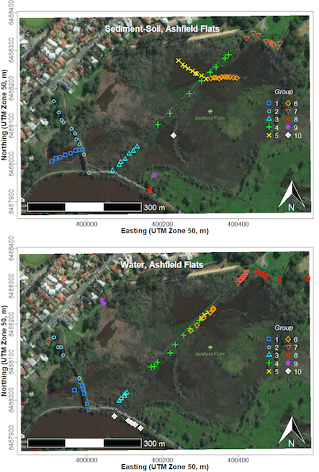

<style type="text/css">
  body{
  font-size: 12pt;
}
</style>

```{r addimg function, include=FALSE}
library(png)
addImg <- function(obj, x = NULL, y = NULL, width = NULL, interpolate = TRUE){
  if(is.null(x) | is.null(y) | is.null(width)){stop("Must provide args 'x', 'y', and 'width'")}
  USR <- par()$usr ; PIN <- par()$pin ; DIM <- dim(obj) ; ARp <- DIM[1]/DIM[2]
  WIDi <- width/(USR[2]-USR[1])*PIN[1] ;   HEIi <- WIDi * ARp 
  HEIu <- HEIi/PIN[2]*(USR[4]-USR[3]) 
  rasterImage(image = obj, xleft = x-(width/2), xright = x+(width/2),
            ybottom = y-(HEIu/2), ytop = y+(HEIu/2), interpolate = interpolate)
}
```

<div style="border: 2px solid #039; padding: 8px;">
<p style="text-align:center; font-size:12pt;">
<em>Maps / spatial pages</em>: [Maps](maps.html){style="color:#04b;"} | 
[Spatial statistics](spatial.html){style="color:#04b;"} | 
[Spatial interpolation](spat-interp.html){style="color:#04b;"}</p>
</div>

&nbsp;

<div style="border: 2px solid #039; background-color:#fec; padding: 8px;">
<p style="text-align:center; font-size:12pt;">
**UWA Students**: <a href="#TandL">Go here for Learning Objectives and suggested activities on this page</a></p>
</div>

&nbsp;

# Introduction {align="right" width=203 height=234}

This guide shows some of the more common and/or easy ways to make maps in **R**
using map-tile-based backgrounds with data plotted over the base maps. We
introduce *coordinate reference systems*, *recommended packages* which allow
tile-based map drawing, a few ways of *including user data*, and an Appendix on
simple *coordinate conversion*. <br>
The intention is to provide options to plot informative maps, which include the
type of data collected in this class, relatively simply. We *will not* cover
vector-based maps, importing GIS shapefiles, interpolation of point data,
chloropleth maps, and many other map plotting methods.

<div style="border: 2px solid gray; background-color:#fff0e0; padding: 8px;">

**Notes about maps**

[distilled from the author instructions of a few relevant journals] 

- Include a <span style="color:red;">**scale**</span>, and <span style="color:red;">**north arrow**</span> (and where relevant, <span style="color:red;">**co-ordinates**</span> of latitude (°N, °S) and longitude (°W, °E);<br /><span style="color: #6000B0;">grid-based systems such as UTM are also ok, and can allow scale to be omitted if grid measurements are in metres).</span>
- The use of colour unnecessarily is discouraged. 
- All text must be large enough to be readable. Avoid making the lettering too large for the figure &ndash; this can result in a "cartoonish" appearance.  
- Use a clear, sans serif typeface &ndash; the **R** default is <span style="color:red; font-family:Arial;">Arial</span> (<span style="color:red; font-family:Helvetica;">Helvetica, </span><span style="color:red; font-family:'Segoe UI';">Segoe UI, </span><span style="color:red; font-family:'Source Sans Pro';">Source Sans Pro, </span><span style="color:red; font-family:ubuntu;">Ubuntu, *etc*. are all OK</span>).  
- Try to keep all text in a figure (including axis labels, contour labels, latitude and longitude, scale text, inset text, *etc.*) around the same size to aid reducibility and/or enlargement.
- Use a white background behind lettering that crosses a dark or textured area in a figure.
- **Locality maps** must show locations of any significant places/sample points, *etc*., mentioned in your report's text or tables. These might include cities, rivers, lakes, ponds, drains, landmarks, presumed sources of contamination, and so on. (These features are not always present on map tiles.)
- A country map is required for all studies, locating the study area. Adjacent countries must be located and named. [*Optional for this class*].
</div>

&nbsp;

### load packages needed to make maps

```{r load-apikey-invisibly, message=FALSE, warning=FALSE, include=FALSE}
secret <- readLines("../thunderforest-API-key.txt")
```

```{r load packages and data show code but DO NOT RUN, eval=FALSE, results='hide'}
library(sf)            # Simple Features spatial data in R
library(maptiles)      # get open-source map tiles for background maps
library(prettymapr)    # add scale bar and north arrows to maps
library(viridis)       # colourblind-friendly colour palettes
library(scico)         # more colourblind-friendly colour palettes
library(ggplot2)       # plotting spatial data with ggplot syntax
library(ggspatial)     # utilities for plotting spatial data
library(ggmap)         # download and plot spatial rasters
```

```{r load packages and data invisibly, error=FALSE, warning=FALSE, include=FALSE, results='hide'}
suppressPackageStartupMessages(
{library(sf)
library(maptiles)
library(prettymapr)
library(viridis)
library(scico)
library(ggplot2)
library(ggspatial)
library(ggmap)}
)
```

...also read some *data* we need for map annotations, make some *colour*
*palettes* to use later, and set any alternative Windows *fonts*:

```{r load maps data and do setups, error=FALSE, message=FALSE, warning=FALSE, results='hold'}
git <- "https://raw.githubusercontent.com/Ratey-AtUWA/Learn-R-web/main/"
afr_map <- read.csv(file=paste0(git,"afr_map_v2.csv"), stringsAsFactors = TRUE)
places <- read.csv(file=paste0(git,"places.csv"), stringsAsFactors = TRUE)
pal4lite <- c("black", viridis::plasma(8),"white", "transparent","grey40")
pal4liteTransp <- c("black", viridis::plasma(8, alpha=0.7), "white", 
                    "transparent","grey40")
pal4dark <- c("white", viridis::turbo(8, beg=0.2, end=0.9,dir=1), "black")
```

## Preparing to make maps

<hr style="height: 2px; background-color: #003087;" />

> "*I wisely started with a map*."
>
> --- [J. R. R. Tolkien](https://www.tolkienestate.com/painting/maps/){target="_blank"}

<hr style="height: 2px; background-color: #003087;" />

First we read the data we need: from `.csv` files on a website, into an **R**
data frame:

```{r read AFR data, warning=FALSE, error=FALSE, results='hold',eval=-1}
afs19 <- read.csv(file=paste0(git,"afs19.csv"), 
                  stringsAsFactors = TRUE) # use this one
afs21ll <- read.csv("afs21ll.csv", stringsAsFactors = T)
```

Before we start downloading map data, we're going to define and save
some commonly-used coordinate reference systems which describe the map
projection of our GPS data. The function `st_crs()` is from the `sf`
package (see explanation below), and as the argument for the
`st_crs()` function we use the EPSG code for the desired projection.
See [https://epsg.io](https://epsg.io){target="_blank"} for more
information. This is optional, but makes things a little easier - we
can just call `st_crs()` directly when we need to include a `crs =`
argument.

```{r define CRS, warning=FALSE, error=FALSE, results='hold'}
LongLat <- st_crs(4326) # uses Earth ellipsis specs from WGS84 datum
UTM50S <- st_crs(32750) # just for Zone 50, S hemisphere!
```

We will use these coordinate reference system objects later. For now
we're going to work in UTM coordinates.

Next we'll convert our data frames to *Simple Features* spatial data,
using the **R** package `sf` (Pebesma, 2018). Simple Features is a
formal standard (ISO 19125-1:2004) that describes how objects in the
real world can be represented in computers - see
[https://r-spatial.github.io/sf/articles/sf1.html](https://r-spatial.github.io/sf/articles/sf1.html){target="_blank"}.

We also make equivalents of these two sf-dataframes in the
longitude&ndash;latitude coordinate system, using the `st_transform`
function. We needed to know (*e.g*. from `summary(afs19)`) that we
have missing coordinate values &ndash; **always check your data!**

```{r read-data, message=FALSE, warning=FALSE, results='hide'}
afs19utm <- st_as_sf(afs19[-9,], # omitting row 9 where coordinates are missing
                     coords = c("Easting","Northing"),
                     crs = UTM50S)
afs21ll <- st_as_sf(afs21ll, coords=c("Longitude", "Latitude"), 
                    crs=LongLat)
afs19ll <- st_transform(afs19utm, crs = LongLat)
afs21utm <- st_transform(afs21ll, crs = UTM50S)
```

<hr style="height: 2px; background-color: #5560A4;" />

&nbsp;

## Alternative 1 &ndash; Maps in R using the maptiles package

### Defining the mapped area

We define the area we need for our map and save it in a simple
features object called `extent`.

An easy way to get bounding coordinates (in longitude, latitude) is by
using [epsg.io](https://epsg.io/map){target="_blank"}, [Google
Maps](https://www.google.com/maps/){target="_blank"} or [Google
Earth](https://earth.google.com/web/){target="_blank"}. The desktop
version of Google Earth allows the option to set the coordinate system
to UTM (but all files are saved in long&ndash;lat (WGS84, which is the
same as EPSG:4326)). If we generated latitude&ndash;longitude
coordinates, we would need to convert our *Simple Features* object
(see the **Appendix**). If our input coordinates are
Longitude&ndash;Latitude, note that south latitudes (and west
longitudes) are negative, and we want decimal degrees rather than
degrees-minutes-seconds. Also note that coordinates from Google Maps
and Google Earth (*except* in saved `.kml` files) are in the order
(Latitude, Longitude); *i.e*. $(y,x)$, whereas $(x,y)$ (Longitude,
Latitude) seems to make more sense.

For coordinates in the `sf` and `maptiles` packages, $x$ coordinates
are commonly Eastings or Longitudes, and $y$ coordinates are commonly
Northings or Latitudes.

```{r make map extent object, warning=FALSE, error=FALSE, results='hold'}
extent <- st_as_sf(data.frame(x=c(399900,400600),y=c(6467870,6468370)),
                   coords = c("x","y"), crs = UTM50S)
```

**NOTE**: The projection we specify here will be the one the map plots in!

### Getting the map tile data

We now need some functions from the `maptiles` package (Giraud 2021).
We're using one of the OpenStreetMap tile options, but the following
tile providers also work: <br>
`OpenStreetMap, OpenStreetMap.HOT, Esri.WorldStreetMap, Esri.WorldTopoMap, Esri.WorldImagery, Esri.WorldGrayCanvas`,
`CartoDB.Positron, CartoDB.DarkMatter, CartoDB.Voyager` (all CartoDB... tiles 
have variants which work), and `OpenTopoMap` <br>
If you have an account with an API key, you can also use the tiles from
[Thunderforest](https://www.thunderforest.com/){target="_blank"} (Thunderforest
'hobby project' accounts are free). The Stamen tiles are now available again 🤓
&ndash; you can register for a free API key at
[stadiamaps.com/stamen](https://stadiamaps.com/stamen){target="_blank"}.<br>
The option `crop = TRUE` is included to crop the tiles to our
defined area in the `extent` object. If we leave it out, the map may change
shape as it will use only square (uncropped) map tiles.

The map tile style we have selected is the default `OpenStreetmap` style.

```{r get_tiles, warning=FALSE, error=FALSE, results='hold'}
# NOTE: projection of input object e.g. 'extent' sets map projection
aftiles <- get_tiles(extent, provider = "OpenStreetMap", crop = TRUE)
```

&nbsp;

### Plotting the map

The `aftiles` object we created is a `SpatRaster` object which needs the
`maptiles` (or `terra`) package loaded to be able to plot it &ndash; see 
Figure 1.

```{r plot-map1-axes, fig.align='center', fig.cap="Figure 1: Map of Ashfield Flats in the UTM projection, generated using the `maptiles` R package, with OpenStreetMap tiles.", fig.width=6.8, out.width='70%', results='hold', fig.height=5.1, message=FALSE, warning=FALSE}
aftiles <- get_tiles(extent, provider = "OpenStreetMap", 
                               crop = TRUE, zoom=16)
par(mar=c(3,3,1.3,1.2), mgp=c(1.6,0.2,0), tcl=-0.2, font.lab=2, lend="square")
plot(st_coordinates(extent), asp=1, type="n", xaxs="i", yaxs="i", cex.axis=0.8,
     xlab="Easting (UTM Zone 50, m)", ylab="Northing (UTM Zone 50, m)")
plot_tiles(aftiles, add=TRUE)
box() # re-draw box in case tiles overlap
```

&nbsp;

At this stage, after plotting the map in RStudio, you will probably
need to adjust the size and proportions of your plot area manually, so
that the map tiles fill the whole plot frame.


Figure 2: Resizing the RStudio `Plots` pane to match the size of the 
plot area to the `maptiles` background.

&nbsp;

The next chunk of code adds the `prettymapr` features shown in Figure
2. In this code, `plotepsg = 32750` refers to the EPSG code for the
UTM projection in Zone 50 (EPSG 32750), which we need to include so
that the scale bar shows the correct distances. (Long-Lat is EPSG 4326
in WGS84)

**NOTE**: If the `addscalebar` function does not work, run this line of code:
```{r load-modified-addscalebar-function}
source("https://github.com/Ratey-AtUWA/Learn-R/raw/main/scalebar_use_sf_prettymapr.R")
```
(This will replace the function in the `prettymapr` package with a modified 
version that uses the `sf` package for coordinate conversions instead of `sp` and `rgdal`.)

```{r map-north-scale-pretend, eval=FALSE, message=FALSE, warning=FALSE}
# . . . continuing previous code . . .
addnortharrow(text.col=1, border=1)
addscalebar(plotepsg = 32750, label.col = 1, linecol = 1, 
            label.cex = 1.2, htin=0.15, widthhint = 0.15)
```

&nbsp;

<div style="border: 2px solid #039; background-color: #e0f0ff; padding: 8px;">
**Map annotations using maptiles &ndash; <em>Hints</em>**

Plotting in the `maptiles` package using the `plot_tiles()` function (which is
actually done by the `plotRGB()` from the `terra` package) tries to set the plot
margins based on the dimensions of the `SpatRaster` map object. This can create
some problems in our experience, so here are some tips:

- Draw a `'base-R'` plot which is an empty frame, over which you plot the 
`maptiles` object. We do this by:
  - setting margins and so on using the `par()` function
  - setting `asp=1` as an option in the `plot()` function to make $x$ and $y$ distances equivalent on the map
  - setting `xaxs="i"` and `yaxs="i"` as options in the `plot()` function, so axis ranges exactly match the size of the map tiles raster 
- use the option `add=TRUE` in the `plot_tiles()` function  
  (this overplots the `maptiles` object onto your empty plot frame)
- adjust the height and width of the RStudio plot area to best match the map
- You may need to adjust the positions of the map annotations like north arrow and scale bar. 
  - these are adjusted with the `padin=` option in the `addnortharrow()` and `addscalebar()` functions
  - note that the `addscalebar()` function needs the option `plotepsg=...`, where the value is the EPSG code for the coordinate reference system you are using (we specify `plotepsg=32750` which is the EPSG code for UTM Zone 50S using WGS84). 
  - note also that the `addscalebar()` function depends on the older spatial package `sp` which is scheduled for retirement. If it doesn't work on your computer, run the following code to create a replacement `addscalebar()` function which uses the `sf` package instead of `sp`:
</div>

```{r addscalebar-using-sf, message=FALSE, warning=FALSE}
git <- "https://github.com/Ratey-AtUWA/Learn-R-web/raw/refs/heads/main/"
source(paste0(git, "scalebar_use_sf_prettymapr.R"))
```

&nbsp;

```{r map-north-scale, fig.align='center', fig.cap="Figure 3: Map of Ashfield Flats (UTM), with added North arrow and scale bar from the `prettymapr` package, over OpenStreetMap tiles acquired using `maptiles`.", fig.height=5.1, fig.width=6.8, message=FALSE, warning=FALSE, out.width='70%', results='hold',echo=FALSE}
par(mar=c(3,3,1.3,1.2), mgp=c(1.6,0.2,0), tcl=-0.2, font.lab=2, lend="square")
plot(st_coordinates(extent), asp=1, type="n", xaxs="i", yaxs="i", cex.axis=0.8,
     xlab="Easting (UTM Zone 50, m)", ylab="Northing (UTM Zone 50, m)")
plot_tiles(aftiles, add=TRUE) ; box()
addnortharrow(text.col=1, border=1)
addscalebar(plotepsg = 32750, label.col = 1, linecol = 1, 
            label.cex = 1.2, htin=0.15, widthhint = 0.15)
```

&nbsp;

### Adding our data and map annotations

Very often we would like to **add our own information to a map**, such
as the location of samples, often with different sizes, shapes, or
colours of symbols to represent numerical information.

Since we have a map in UTM coordinates, we can now add plots of our data based
on UTM locations (with a legend, of course &ndash; see Figure 4). We can plot
the points from the non-spatial data frame `afs19`, but here we `plot` the
points from `afs19utm`, with the `add=TRUE` option. We add a legend to the plot
in the usual way.

```{r add-data-pretend, eval=FALSE, message=FALSE, warning=FALSE}
# . . . continuing from previous code . . .
clrz <- plasma(15)[6:15]   # plasma is one of the viridis:: palettes
with(afs19utm, plot(geometry, add=TRUE,  
                    pch = rep(21:25,2)[Group], 
                    bg = clrz[Group]))
legend("bottomright", legend=levels(as.factor(afs19$Group)),
       pch = rep(21:25,2), pt.bg = clrz,
       title = "Group", inset = 0.02, ncol = 2)
```

```{r add-data, eval=TRUE, message=FALSE, warning=FALSE, out.width='70%',echo=FALSE, fig.height=5.1, fig.width=6.8, fig.cap = "Figure 4: Map of Ashfield Flats (UTM), with user data plotted, over OpenStreetMap tiles acquired using `maptiles` and North arrow and scale bar from the `prettymapr` package.", fig.align='center', results='hold'}
par(mar=c(3,3,1.3,1.2), mgp=c(1.6,0.2,0), tcl=-0.2, font.lab=2, lend="square")
plot(st_coordinates(extent), asp=1, type="n", xaxs="i", yaxs="i", cex.axis=0.8,
     xlab="Easting (UTM Zone 50, m)", ylab="Northing (UTM Zone 50, m)")
plot_tiles(aftiles, add=TRUE) ; box()
addnortharrow(text.col=1, border=1)
addscalebar(plotepsg = 32750, label.col = 1, linecol = 1, 
            label.cex = 1.2, htin=0.15, widthhint = 0.15)
clrz <- plasma(15)[6:15]
with(afs19utm, plot(geometry, add=TRUE,  
                    pch = rep(21:25,2)[Group], 
                    bg = clrz[Group]))
legend("bottomright", legend=levels(as.factor(afs19$Group)),
       pch = rep(21:25,2), pt.bg = clrz,
       title = "Group", inset = 0.02, ncol = 2)
```

&nbsp;

We can also add digitized map features such as wetland ponds, drains,
*etc*., if these are not on the map tiles already. Ideally we would add
these **before** plotting the data, to avoid the type of overplotting
shown in Figure 5.

```{r annot-pretend, eval=FALSE, error=FALSE, warning=FALSE}
# . . . continuing from previous code . . .
with(afr_map, lines(drain_E, drain_N, col = "cadetblue", lwd = 2))
with(afr_map, lines(wetland_E, wetland_N, col = "cadetblue", lwd = 1, lty = 2))
```

```{r map-annot, error=FALSE, warning=FALSE, echo=FALSE, fig.height=5.1, fig.width=6.8, fig.align='center', out.width="70%", fig.cap="Figure 5: Map of Ashfield Flats (UTM), with added North arrow, scale bar, user data, and additional map items, over OpenStreetMap tiles acquired using `maptiles`.", results='hold'}
# everything we did above in the first line
par(mar=c(3,3,1.3,1.2), mgp=c(1.6,0.2,0), tcl=-0.2, font.lab=2, lend="square")
plot(st_coordinates(extent), asp=1, type="n", xaxs="i", yaxs="i", cex.axis=0.8,
     xlab="Easting (UTM Zone 50, m)", ylab="Northing (UTM Zone 50, m)")
plot_tiles(aftiles, add=TRUE) ; box()
addnortharrow(text.col=1, border=1)
addscalebar(plotepsg = 32750, label.col = 1, linecol = 1, 
            label.cex = 1.2, htin=0.15, widthhint = 0.15)
clrz <- plasma(15)[6:15]
with(afs19utm, plot(geometry, add=TRUE,  
                    pch = rep(21:25,2)[Group], 
                    bg = clrz[Group]))
legend("bottomright", legend=levels(as.factor(afs19$Group)),
       pch = rep(21:25,2), pt.bg = clrz,
       title = "Group", inset = 0.02, ncol = 2)
with(afr_map, 
     lines(drain_E, drain_N, col = "cadetblue", lwd = 2))
with(afr_map, polygon(wetland_E, wetland_N, border="cadetblue", col="#5F9EA080", 
                    lwd = 1, lty = 1))
```

&nbsp;

Finally, we would most likely want to add some text. Text labels should
also be added *before* plotting the data. The final map is shown in
Figure 6.

```{r map-text-labels-pretend, error=FALSE, warning=FALSE, eval=FALSE}
# . . . continuing from previous code . . .
text(c(400263, 399962, 400047), c(6468174, 6468083, 6468237),
     labels = c("Chapman Drain","Kitchener Drain", "Woolcock Drain"),
     pos = c(2,2,4), cex = 0.8, font = 3, col = "cadetblue")
```

```{r map-text-labels, error=FALSE, warning=FALSE, echo=FALSE, fig.height=5.1, fig.width=6.8, fig.align='center', out.width="70%", fig.cap="Figure 6: Map of Ashfield Flats (UTM), with added North arrow, scale bar, user data, and additional map items plus text labels, over OpenStreetMap tiles acquired using `maptiles`.", results='hold'}
# everything we did above in the first line
par(mar=c(3,3,1.3,1.2), mgp=c(1.6,0.2,0), tcl=-0.2, font.lab=2, lend="square")
plot(st_coordinates(extent), asp=1, type="n", xaxs="i", yaxs="i", cex.axis=0.8,
     xlab="Easting (UTM Zone 50, m)", ylab="Northing (UTM Zone 50, m)")
plot_tiles(aftiles, add=TRUE) ; box()
addnortharrow(text.col=1, border=1)
addscalebar(plotepsg = 32750, label.col = 1, linecol = 1, 
            label.cex = 1.2, htin=0.15, widthhint = 0.15)
clrz <- plasma(15)[6:15]
with(afs19utm, plot(geometry, add=TRUE,  
                    pch = rep(21:25,2)[Group], 
                    bg = clrz[Group]))
legend("bottomright", legend=levels(as.factor(afs19$Group)),
       pch = rep(21:25,2), pt.bg = clrz,
       title = "Group", inset = 0.02, ncol = 2)
with(afr_map, 
     lines(drain_E, drain_N, col = "cadetblue", lwd = 2))
with(afr_map, polygon(wetland_E, wetland_N, border="cadetblue", col="#5F9EA080", 
                    lwd = 1, lty = 1))
text(c(400263, 399982, 400047), c(6468174, 6468143, 6468237),
     labels = c("Chapman Drain","Kitchener\nDrain", "Woolcock Drain"),
     pos = c(2,1,4), cex = 0.8, font = 3, col = "cadetblue")
```

&nbsp;

<div style="border: 2px solid #fd0; padding: 5px;">
Figure 6 should be plotted with the data symbols on top of the added map
features like drains. We have provided code for this in the [Bonus Material](#bonus-material) at
the end!
</div>


### Making a bubble map

We use essentially the same code as for the maps above (except plotting the
annotations and data in the correct order!). Then we use the `symbols()`
function to make the 'bubbles', making sure that we include the options 
`add = TRUE` so we overplot the map, and `inches = FALSE` so we can manually
scale the bubbles. The factor `s0` used to scale the circles in the code for
bubbles and legend is found using a simple algorithm to estimate a scaling
factor from the data). A map like that shown in Figure 7 is a good exploratory
data analysis tool, as even without the legend it shows any unevenness in
concentrations, including where high concentrations are located.

```{r map-bubbles, fig.align='center', fig.cap="Figure 7: Bubble map of zinc concentrations in sediment and soil at Ashfield Flats in 2019, over OpenStreetMap tiles acquired using `maptiles`.", fig.height=5.1, fig.width=6.8, message=FALSE, warning=FALSE, out.width='70%', results='hold'}
palette(pal4lite)
par(mar=c(3,3,1.3,1.2), mgp=c(1.6,0.2,0), tcl=-0.2, font.lab=2, lend="square")
plot(st_coordinates(extent), asp=1, type="n", xaxs="i", yaxs="i", cex.axis=0.8,
     xlab="Easting (UTM Zone 50, m)", ylab="Northing (UTM Zone 50, m)")
plot_tiles(aftiles, add=TRUE) ; box()
addnortharrow(text.col=1, border=1)
addscalebar(plotepsg = 32750, label.col = 1, linecol = 1, 
            label.cex = 1.2, htin=0.15, widthhint = 0.15)
with(afr_map, 
     lines(drain_E, drain_N, col = "cadetblue", lwd = 2))
with(afr_map, polygon(wetland_E, wetland_N, border="cadetblue", col="#5F9EA080", 
                    lwd = 1, lty = 1))
text(c(400263, 399982, 400047), c(6468174, 6468143, 6468237),
     labels = c("Chapman Drain","Kitchener\nDrain", "Woolcock Drain"),
     pos = c(2,1,4), cex = 0.8, font = 3, col = "cadetblue")
# plot bubbles using the symbols() function
  # first use a simple algorithm to estimate a scale factor for bubbles
  axrg <- par("usr")[2]-par("usr")[1]
  bublo <- pretty(afs19$Zn)[2]
  bubhi <- pretty(afs19$Zn)[length(pretty(afs19$Zn))]
  s0 <- signif(0.05*axrg/sqrt(bubhi),2)
with(afs19, symbols(Easting, Northing, add = TRUE, circles = s0*sqrt(Zn),
                    inches = FALSE, fg = "purple", bg = "#8000FF40"))
# manual legend
  # first make small legend bubble, checking if it's zero 
  if (pretty(afs19$Zn)[1] < 0.001) {
    bublo <- pretty(afs19$Zn)[2]/2
  } else {
    bublo <- pretty(afs19$Zn)[1]
  }
symbols(c(400520,400520),c(6468040,6467980), circles=s0*sqrt(c(bublo,bubhi)), add=T,
        lwd=1, inches=F, fg = "purple", bg = "#8000FF40")
text(c(400520,400550,400550),c(6468100,6468040,6467980), 
     labels=c("Zn (mg/kg)",bublo,bubhi), cex=0.85, pos = c(1,4,4))
```

&nbsp;

When reporting on an environmental assessment process such as a 
[Detailed Site Investigation](https://www.nepc.gov.au/sites/default/files/2022-09/schedule-b2-guideline-site-characterisation-sep10.pdf){target="_blank"},
we should also identify any samples where environmental guideline values are
exceeded. The additional code below shows how to do this for Zn in sediments;
the relevant guideline values are DGV&nbsp;=&nbsp;200&nbsp;mg/kg,
DGV-high&nbsp;=&nbsp;410&nbsp;mg/kg. The re-drawn map (Figure 8) shows samples
above the 410&nbsp;mg/kg DGV-high threshold, and could also be adapted to show
concentrations greater than the DGV, or both.

Note the double plotting of points, first with a thicker line (`lwd=4`) to 
provide a border around the symbols for better visual contrast.

```{r fake-bubbles-DGV, message=FALSE, warning=FALSE, eval=FALSE}
# ... continuing most of previous code ...

# plot points exceeding guideline value...
with(afs19[which(afs19$Zn>=410),], points(Easting, Northing, pch=3,lwd=4,col=1))
with(afs19[which(afs19$Zn>=410),], points(Easting, Northing, pch=3,lwd=2,col=8))

# ...and make changes to manual legend
symbols(c(400500,400500),c(6468040,6467980), circles=s0*sqrt(c(bublo,bubhi)), add=T,
        lwd=1, inches=F, fg = "purple", bg = "#8000FF40")
points(400500, 6467920, pch=3,lwd=4,col=1)
points(400500, 6467920, pch=3,lwd=2,col=8)
text(c(400500,400530,400530,400510),c(6468100,6468040,6467980,6467920), 
     labels=c("Zn (mg/kg)",bublo,bubhi,"\u2265 DGV-high"), cex=0.85, pos = c(1,4,4,4))
```

```{r map-bubbles-DGV, fig.align='center', fig.cap="Figure 8: Bubble map of zinc concentrations in sediment and soil at Ashfield Flats in 2019, over OpenStreetMap tiles acquired using `maptiles`. Locations where Zn concentration exceeds the DGV-high threshold are shown.", fig.height=5.1, fig.width=6.8, message=FALSE, warning=FALSE, out.width='70%', echo=FALSE}
par(mar=c(3,3,1.3,1.2), mgp=c(1.6,0.2,0), tcl=-0.2, font.lab=2, lend="square")
plot(st_coordinates(extent), asp=1, type="n", xaxs="i", yaxs="i", cex.axis=0.8,
     xlab="Easting (UTM Zone 50, m)", ylab="Northing (UTM Zone 50, m)")
plot_tiles(aftiles, add=TRUE) ; box()
addnortharrow(text.col=1, border=1)
addscalebar(plotepsg = 32750, label.col = 1, linecol = 1, 
            label.cex = 1.2, htin=0.15, widthhint = 0.15)
with(afr_map, 
     lines(drain_E, drain_N, col = "cadetblue", lwd = 2))
with(afr_map, polygon(wetland_E, wetland_N, border="cadetblue", col="#5F9EA080", 
                    lwd = 1, lty = 1))
text(c(400263, 399982, 400047), c(6468174, 6468143, 6468237),
     labels = c("Chapman Drain","Kitchener\nDrain", "Woolcock Drain"),
     pos = c(2,1,4), cex = 0.8, font = 3, col = "cadetblue")
# plot bubbles using the symbols() function
  # first use a simple algorithm to estimate a scale factor for bubbles
  axrg <- par("usr")[2]-par("usr")[1]
  bublo <- pretty(afs19$Zn)[2]
  bubhi <- pretty(afs19$Zn)[length(pretty(afs19$Zn))]
  s0 <- signif(0.05*axrg/sqrt(bubhi),2)
with(afs19, symbols(Easting, Northing, add = TRUE, circles = s0*sqrt(Zn),
                    inches = FALSE, fg = "purple", bg = "#8000FF40"))
with(afs19[which(afs19$Zn>=410),], points(Easting, Northing, pch=3,lwd=4,col=1))
with(afs19[which(afs19$Zn>=410),], points(Easting, Northing, pch=3,lwd=2,col=9))
# manual legend
  # first make small legend bubble, checking if it's zero 
  if (pretty(afs19$Zn)[1] < 0.001) {
    bublo <- pretty(afs19$Zn)[2]/2
  } else {
    bublo <- pretty(afs19$Zn)[1]
  }
symbols(c(400450,400450),c(6468040,6467980), circles=s0*sqrt(c(bublo,bubhi)), add=T,
        lwd=1, inches=F, fg = "purple", bg = "#8000FF40")
points(400450, 6467920, pch=3,lwd=4,col=1)
points(400450, 6467920, pch=3,lwd=2,col=9)
text(c(400450,400480,400480,400460),c(6468100,6468040,6467980,6467920), 
     labels=c("Zn (mg/kg)",bublo,bubhi,"\u2265 DGV-high"), cex=0.85, pos = c(1,4,4,4))
```

&nbsp;

### Categorized (*e.g*. percentile) bubble map

We make a new column in our data frame by `cut`ting the measurement of
interest, in this example **Zn**, into percentiles. The new column called `QZn`
is a factor which identifies which percentile of Zn concentration each sample is
in. We then use this factor to define symbols, sizes, and colours for each
sample location. We add a line break to text labels using $\backslash$`n`.

```{r PctBubb, fig.align='center', fig.cap="Figure 9: Map showing percentile ranges of zinc concentrations in sediment and soil at Ashfield Flats in 2019, over OpenStreetMap tiles acquired using `maptiles`.", out.width='70%', fig.height=5.1, fig.width=6.8, message=FALSE, warning=FALSE, results='hold'}
par(mar=c(3,3,1.3,1.2), mgp=c(1.6,0.2,0), tcl=-0.2, font.lab=2, lend="square")
plot(st_coordinates(extent), asp=1, type="n", xaxs="i", yaxs="i", cex.axis=0.8,
     xlab="Easting (UTM Zone 50, m)", ylab="Northing (UTM Zone 50, m)")
plot_tiles(aftiles, add=TRUE) ; box()
addnortharrow(text.col=1, border=1)
addscalebar(plotepsg = 32750, label.col = 1, linecol = 1, 
            label.cex = 1.2, htin=0.15, widthhint = 0.15)
with(afr_map, 
     lines(drain_E, drain_N, col = "cadetblue", lwd = 2))
with(afr_map, polygon(wetland_E, wetland_N, border="cadetblue", col="#5F9EA080", 
                    lwd = 1, lty = 1))
text(c(400263, 399982, 400047), c(6468174, 6468143, 6468237),
     labels = c("Chapman Drain","Kitchener\nDrain", "Woolcock Drain"),
     pos = c(2,1,4), cex = 0.8, font = 3, col = "cadetblue")

# Percentile plot
#   make a factor column which categorizes each sample by 
#   which Zn percentile it is in:
afs19$QZn <- cut(afs19$Zn, quantile(afs19$Zn, 
                 p=c(0,0.02,0.05,0.25,0.5,0.75,0.95,0.98,1), 
                 na.rm=T), labels=c("Q0-02","Q02-05","Q05-25","Q25-50",
                                    "Q50-75","Q75-95","Q95-98","Q98-max"))
palette(pal4liteTransp) # use colours with semi-transparency (defined near top)
# use percentile factor column to categorize points
with(afs19, 
     points(Easting, Northing, 
            pch = c(22,22,22,3,4,21,21,21)[QZn], 
            col = c(1,1,1,4,5,1,1,1)[QZn], bg = c(2:9)[QZn],
            lwd = c(1,1,1,2,2,1,1)[QZn], 
            cex = c(0.7,0.9,1.1,1.3,1.3,2,3,4)[QZn])
     )
# use rev() in the legend to reverse order to greatest values at top
legend("bottomright", legend = rev(levels(afs19$QZn)), 
       title=expression(bold("Zn")),
       pch = rev(c(22,22,22,3,4,21,21,21)), col = rev(c(1,1,1,4,5,1,1,1)),
       pt.lwd = rev(c(1,1,1,2,2,1,1)), pt.bg = rev(c(2:9)), 
       pt.cex = rev(c(0.7,0.9,1.1,1.3,1.3,2,3,4)),
       bty = "n", inset = c(0.01,0.01), cex = 0.85, y.intersp = 1.2)
palette(pal4lite) # change back to non-transparent palette (optional)
afs19$QZn <- NULL # to delete quantile column (optional; you can leave it in)
```

The resulting percentile bubble map (Figure 9) adds value to the 'standard'
bubble map (Figure 7), as it adds some statistical meaning to the bubble sizes.
A similar map could be created by using the Tukey boxplot thresholds instead of
percentiles which could show potential outliers (*i.e*. using the
`boxplot.stats()` function to generate categories instead of the `quantile()`
function.)

&nbsp;

<div style="border: 2px solid #039; padding: 8px;">
<span style="font-size: 14pt;">**Warning**: semi-transparent colours 
(*i.e*. alpha < 1) are not supported by metafiles in R. To use semi-transparent 
colours, save as `.png` or `.tiff`, or copy as a bitmap.</span>
</div>

&nbsp;

## Alternative 2 – Maps in R with ggplot2, ggspatial, &amp; ggmap packages

The `ggplot2` package (Wickham, 2016; we may just call it `ggplot`) includes
functions such as `geom_sf()` which allow us to work with spatial data within
`sf` objects. Additional functions are available in the package `ggspatial`
(Dunnington, 2023), including the ability to annotate plots with rasters
obtained with the `maptiles` package.

The plot below illustrates how we can do this, using the University of Western 
Australia campus as an example.

* we make a `sf` object to define the map extent, as we did above for base-R
  maps, then download a map tile raster based on this extent
* we make a `sf` object from our `places` data frame, so we can add it to the
map using `geom_sf()`
* we make a `maptiles` raster image as we've done previously, first making a `sf`
object to define the extent, then using the `get_tiles()` function
* we plot the raster extent object (`UWAext` in this example) as a transparent
layer, since the final map extent will be set by `geom_sf()` functions, **not**
the size of the raster (`UWArast`)
* we plot the raster **first** in the code using `annotation_spatial()`, so the
subsequent layers plot on top of it
* see the comments in the code for additional hints

```{r ggmap2, fig.height=5, fig.width=6, message=FALSE, warning=FALSE}
UWAext <- st_as_sf(data.frame(X=c(115.812,115.825), Y=c(-31.987, -31.975)),
                   coords=c("X","Y"), crs=4326)
UWArast <- get_tiles(UWAext, zoom=16, provider="CartoDB.Positron", 
                     forceDownload = T, crop=T)
places_sf <- st_as_sf(places, coords=c("Longitude","Latitude"), crs=4326, 
                      remove=F)
ggplot() +
  # a) set the dimensions by plotting the extent object transparently
    geom_sf(data=UWAext, col="transparent") +
  # b) Plot the raster
    annotation_spatial(UWArast) +
  # c) ensure plot axes exactly fit the extent
    scale_x_continuous(expand = c(0,0)) +
    scale_y_continuous(expand = c(0,0)) +
  # d) Plot points, shape and colour by the column places_sf$Type
    geom_sf(data=places_sf, aes(shape=Type, fill=Type), size = 3) +
    scale_shape_manual(values = c(21,22)) +
  # e) Axis labels
    labs(x = "Longitude", y = "Latitude") +
  # f) North arrow + scale bar from ggspatial::
    annotation_north_arrow(location = "tr", style=north_arrow_nautical) +
    annotation_scale(location = "bl", width_hint = 0.25) +
  # g) custom theme
    theme(
      panel.border = element_rect(colour="black", fill="transparent"),
      legend.title = element_text(face="bold"),
      axis.text = element_text(size = 8),
      axis.title = element_text(size = 11, face="bold")
    )
```

&nbsp;

The `ggmap` package (Kahle and Wickham 2013) is an extension of `ggplot`, so
it's easier to use if you are familiar with `ggplot` and the associated family
of packages. It has functions to download map tiles from Google and other
providers [*You will need a Google maps API key which you can get by registering at [https://developers.google.com/maps](https://developers.google.com/maps){target="_blank"}*]{style="color: #A00000;"}

```{r get-api-key, include=FALSE}
secret <- read.csv("../gmapskey.csv")[1,1]
```

First we make a `ggmap` object, locating the map by its central coordinate with
the extent controlled by the `zoom` option:

```{r make ggmap object, message=FALSE, warning=FALSE, eval=-1, results='hold', echo=-4}
library(ggmap)
register_google(key = secret) # you would replace secret with your API key
udubua.gg <- get_googlemap(center=c(115.8213,-31.98165), 
                           zoom = 16, maptype = "roadmap", color = "bw")
rm(secret)
```

This always gives a **square** map (Figure 11) &ndash; which we might not always
want. In theory, the map aspect ratio can be changed using the `size` argument
in the `get_googlemap` function, but this does not work reliably. We recommend
leaving the map dimensions and aspect ratio at their default values.

Next we plot the ggmap object using ggplot grammar. It's possible to just plot
the object (*i.e*. run `ggmap(udubua.gg)`), but it's good to have more control
over plot options **and** to plot some data over the base map. In the example in
Figure 9, we use the aesthetic in `geom_point()` to plot different categories
with different shapes and colours, with the categories defined by the factor
`Type`. A range of map styles is available by selecting a combination of one of
`maptype = "terrain", "satellite", "roadmap"`, or `"hybrid"`, together with
`color = "color"` or `"bw"`. **Note**: the `ggsm` package is designed to add
scale bar and north arrow to ggmaps, but it seems buggy and we currently don't
recommend it - the north arrow seems OK though.

```{r ggmap1, fig.height=4.5, fig.width=6, fig.align='center', fig.cap="Figure 11: Map of the University of Western Australia campus at Crawley, showing the location of libraries and cafés, plotted over Google maps tiles acquired using the `R` package `ggmap`.", out.width='75%', message=FALSE, warning=FALSE, results='hold'}
ggmap(udubua.gg) + 
  labs(y="Latitude (\u00B0S)", x = "Longitude (\u00B0E)") + 
  geom_text(aes(x = 115.825, y = -31.98, label = "Swan\nRiver",
                fontface = "italic", family="sans"), 
            size = 4, vjust = 0, hjust = 0, color="gray40") + 
  geom_point(aes(x = Longitude, y = Latitude, col=Type, shape=Type), 
             data = places, size=3) +
  theme_bw() +
  theme(axis.text=element_text(size=9, color="black"),
        axis.title=element_text(size=11,face="bold"))
```

&nbsp;

There are numerous possibilities with `ggmap` and the features made possible by
`ggplot2` that are not illustrated by Figure 10. For example, we could use `size`
as an aesthetic (*i.e*. include within `aes(...)` with `size = variableName`),
to generate something like a bubble map.

&nbsp;

### Other map types using ggmap

Other options available in `ggmap` are some of the *Stamen* map tiles from
*Stadia*, accessible with the `get_stadiamap()` function. To use the Stamen
maps, you need to first register for a free API key at
[stadiamaps.com/stamen](https://stadiamaps.com/stamen){target="_blank"}.

<div style="border: 2px solid #039; background-color:#e8e8e8; padding: 5px; margin-left: 32px; margin-right: 32px;">
You could also make a map based on Stamen tiles by using `maptiles` to make a 
spatial raster, and plotting with `ggplot2` and `ggspatial` as we did above. You 
would still need an API key for the Stadia Stamen maps API. 💡&nbsp;Try&nbsp;it!
</div>

[**The next example**]{style="size: 14pt"} (Figure 12) uses the simple features
information in one of the data frames we made at the beginning. The `sf` package
introduces a new 'geom', `geom_sf()` for plotting in `ggmap.` We need to use the
option `inherit.aes = FALSE` in `geom_sf()`, to override the default aesthetics
from the `ggmap` object. We also add `coord_sf` to ensure that all layers use a
common CRS (<u>C</u>oordinate <u>R</u>eference <u>S</u>ystem). <br> Run
`help(geom_sf)` for more information.

Plotting using `geom_sf()` when the CRS is in degrees adds, by default, a
&deg;S/&deg;W/&deg;N/&deg;E suffix to the axis values. In the code below we
suppress this using `scale_x_continuous(label = I)` (same for the y axis; the
`limits` and `expand` options stop the manual scale adding space around the map
tiles). We include the information on units and hemisphere in the axis titles.

The code also has a little fun with the symbol fill colours. We set these using 
`scale_fill_viridis()`, but instead of choosing a single `viridis` palette 
option, we choose one at random using `option=sample(LETTERS[1:8],1)`. [If you 
don't like this, change the code to `option="D"`, the standard viridis palette.]

```{r register-stadia, include=FALSE}
secret2 <- read.csv("../StadiaMaps-API.csv")[1,1]
```

```{r ggAF, fig.height=4.5, fig.width=8, fig.align='center', fig.cap="Figure 12: Zinc concentration (mg/kg) in sediment sampled in Semester 1, 2021 at Ashfield Flats, Western Australia, plotted over `stamen_terrain` map tiles acquired using the `R` package `ggmap`, with data in a simple features data frame, and with manually added wetland pond locations.", out.width='85%', message=FALSE, warning=FALSE, results='hold'}
register_stadiamaps(key=secret2)
afr.gg <- 
  get_stadiamap(bbox=c(left=115.9393, bottom=-31.9203, 
                       right=115.948, top=-31.916),
                maptype="stamen_terrain", zoom=17)
bb <- as.numeric(unlist(as.vector(attr(afr.gg, "bb"))))
ggmap(afr.gg) + 
  labs(y="Latitude (\u00B0S)", x = "Longitude (\u00B0E)") + 
  geom_text(aes(x = 115.944, y = -31.918, label = "Ashfield\nFlats",
                fontface = "italic", family="sans"), 
            size = 4, color="khaki4", lineheight=0.8) +
  geom_text(aes(x = 115.942, y = -31.9199, label = "Swan River",
                fontface="italic", family="sans"), size=4, color="steelblue") +
  geom_path(aes(x = drain_lon, y=drain_lat), data=afr_map, 
            color = "steelblue", size = 1.25) +
  geom_polygon(aes(x=wetland_lon, y=wetland_lat), data = afr_map,
               color = "steelblue", fill="#4682B480") + 
  geom_sf(data = afs21ll, aes(fill=Zn, size=Zn), shape=21, inherit.aes=FALSE) +
  scale_x_continuous(labels = I, limits=c(bb[2],bb[4]), 
                     expand = expansion(mult=c(0,0))) +
  scale_y_continuous(labels = I, limits=c(bb[1],bb[3]), 
                     expand = expansion(mult=c(0,0))) +
  scale_fill_viridis_c(name="Zn", alpha = 0.7,option=sample(LETTERS[1:8],1)) + 
  scale_size_area(name="Zn", breaks=c(30,100,300,1000,3000,5000), max_size = 9) +
  theme_bw() +
  theme(axis.text=element_text(size=9, color="black"),
        axis.title = element_text(size = 12, face = "bold")) +
  coord_sf(crs = st_crs(4326))
```

<hr style="height: 2px; background-color: #5560A4;" />

## Other tile-based mapping packages in R

The `rosm` package (Dunnington 2022) allows users to produce background maps
from several map tile providers. **We don't currently recommend** `rosm`, since
it's difficult when using this package to produce axes in commonly-used
coordinate reference systems.

The `OpenStreetMap` R package (Fellows, 2019) can make very good tile-based
maps. Unfortunately, however, it can be difficult to use on Apple Mac computers,
and there can also be problems with Windows-based systems due to the use of
`Java` code in the package. So, out of respect for MacOS users, we are 
**not recommending the** `OpenStreetMap` package either.

## Final Words

We recommend using either the `maptiles` or `ggmap` packages to draw maps with
tiled backgrounds, as they allow use of the state-of-the-art *simple features*
system *via* the `sf` package.

&nbsp;

<center><br>
[read about it](https://www.iflscience.com/28000-rubber-ducks-accidentally-embarked-on-an-epic-ocean-current-study-in-1992-58342){target="_blank"}</center>

&nbsp;

## Appendix - coordinate conversions

**Converting UTM to LongLat**

Make a simple features (package `sf`) object containing the UTM coordinates

Example uses explicit values (as used previously to generate the `maptiles`
map), but the coordinates could also be obtained from a data frame - edit to
suit!

```{r make utm spatial object, message=FALSE, warning=FALSE, eval=FALSE, results='hold'}
utm.temp <- st_as_sf(data.frame(x=c(399800,400700),y=c(6467900,6468400)),
                     coords = c("x","y"), crs = UTM50S)
```

We then use the `st_transform()` function from the `sf` package to convert to
long-lat (or another projection), which results in another spatial object:

```{r convert utm to longlat, message=FALSE, warning=FALSE, eval=FALSE, results='hold'}
longlat.temp <- st_transform(utm.temp, crs = LongLat)
```

We now have two `sf` spatial objects which we can use (for instance) to
define the map extent for a `maptiles` map:

```{r using converted objects, message=FALSE, warning=FALSE, eval=FALSE, results='hold'}
require(sf); require(maptiles) # load packages if not done already
# using the utm object
tiles_utm <- get_tiles(utm.temp, provider = "OpenStreetMap", crop = TRUE)
# using the longitude-latitude object
tiles_longlat <- get_tiles(longlat.temp, provider = "OpenStreetMap",
                          crop = TRUE)
# . . . and so on
```

To extract coordinates from a data frame, for example: <br>
(**NOTE** - missing coordinates are not allowed!)

```{r utm spatial obj from dataframe, eval=FALSE}
afs19 <- afs19[-which(is.na(afs19[,c("Easting")])==1),] # remove rows with NAs
afs19utm <-  st_as_sf(afs19, coords = c("Easting","Northing"), crs = UTM50S)
```

We then use the `st_transform()` function from the `sf` package to
convert to longitude-latitude, which results in another spatial data frame:

```{r write converted coordinates to dataframe, eval=FALSE}
afs19ll <- st_transform(afs19utm, crs = LongLat)
```

To extract just the coordinate values in non-spatial form, we use the function 
`st_coordinates()`:

```{r extract sf coordinates to matrix, eval=FALSE}
# extract sf coordinates to console (can assign to object of class "matrix")
st_coordinates(afs19utm)

# extract sf coordinates to data frame
longlat.temp <- as.data.frame(st_coordinates(afs19ll))
colnames(longlat.temp) <- c("Longitude","Latitude")
```

<hr style="height: 2px; background-color: #5560A4;" />

## References and R packages

Dunnington, Dewey (2017). *prettymapr: Scale Bar, North Arrow, and Pretty
Margins in R*. R package version 0.2.2.
[https://CRAN.R-project.org/package=prettymapr](https://CRAN.R-project.org/package=prettymapr){target="_blank"}.

Dunnington D (2022). *rosm: Plot Raster Map Tiles from Open Street Map
and* *Other Sources*. R package version 0.2.6,
[https://CRAN.R-project.org/package=rosm](https://CRAN.R-project.org/package=rosm){target="_blank"}.

Dunnington D (2023). `ggspatial`: _Spatial Data Framework for ggplot2_, R package version 1.1.9. [doi:10.32614/CRAN.package.ggspatial](https://doi.org/10.32614/CRAN.package.ggspatial){target="_blank"}

Fellows, Ian and using the JMapViewer library by Jan Peter Stotz (2019).
*OpenStreetMap: Access to Open Street Map Raster Images*. R package
version 0.3.4. [https://CRAN.R-project.org/package=OpenStreetMap](https://CRAN.R-project.org/package=OpenStreetMap){target="_blank"}.

Giraud T (2021). *maptiles: Download and Display Map Tiles*. R package
version 0.3.0, [https://CRAN.R-project.org/package=maptiles](https://CRAN.R-project.org/package=maptiles){target="_blank"}.

Garnier S, Ross N, Rudis R, Camargo AP, Sciaini M, Scherer C (2021). *Rvision - Colorblind-Friendly Color Maps for R*. R package version 0.6.2. (**viridis**)

D. Kahle and H. Wickham. `ggmap`: Spatial Visualization with `ggplot2`. *The R Journal*, **5**(1), 144-161. [http://journal.r-project.org/archive/2013-1/kahle-wickham.pdf](http://journal.r-project.org/archive/2013-1/kahle-wickham.pdf){target="_blank"}.

Pebesma, E., 2018. Simple Features for R: Standardized Support for
Spatial VectorData. *The R Journal* **10** (1), 439-446,
[https://doi.org/10.32614/RJ-2018-009](https://doi.org/10.32614/RJ-2018-009){target="_blank"} . (package `sf`)

Pebesma, E.J., R.S. Bivand, 2005. Classes and methods for spatial data
in R. *R News* **5** (2), [https://cran.r-project.org/doc/Rnews/](https://cran.r-project.org/doc/Rnews/){target="_blank"}.
(package `sp`)

Wickham, H. (2016) `ggplot2`: *Elegant Graphics for Data Analysis*. Springer-Verlag New York, 2016. [https://ggplot2.tidyverse.org](https://ggplot2.tidyverse.org){target="_blank"}.

A BibTeX entry for LaTeX users is

<hr style="height: 2px; background-color: #5560A4;" />

<p style="text-align:center;"></p>

&nbsp;

## For UWA students
<div id="TandL" style="border: 2px solid #039; background-color:#fec; padding: 8px;"> 
# Activities for this Workshop class

{height="298" width="201" align="right"}
There are a few items available as learning materials for this session on **using R + packages to make maps**: two short videos, and two annotated pdfs based on 

1. the R code and 
2. a PowerPoint presentation. 

We suggest going through the first video first, and then trying the code, and finally viewing the second video and trying some different things. The material in the PowerPoint presentation on interpolation of point data is completely optional.

For activities today we suggest:
<ol>
<li>Try to make a map of the Ashfield Flats Reserve area which covers all our sample locations. A good place to start after watching the video/reading the annotated code PDF would be with modifying and running the R code.</li>
</ol>
<p>Good luck!</p>
</div>

&nbsp;

<div id="bonus-material" style="border: 2px solid #039; background-color:#e8e8e8; padding: 5px;"> 
## R Mapping - supporting learning materials

&darr;The best code for mapping using state-of-the-art <b>R</b> packages is in the code in the rest of this page (below) &darr;

### Files to download for this workshop

<a href="https://github.com/Ratey-AtUWA/Learn-R-web/raw/main/afs21ll.csv" target="_blank" rel="noreferrer noopener">{alt="csv file icon" width="32" height="32"}Ashfield&nbsp;Flats sediment soil data <strong>2021</strong></a> &nbsp; &nbsp; <a href="https://github.com/Ratey-AtUWA/Learn-R-web/raw/main/Learn-R-CODE-Maps.R" target="_blank" rel="noreferrer noopener">{alt="R code file icon" width="32" height="32"}&nbsp;Just the code used in this web page</a>

<a href="https://github.com/Ratey-AtUWA/Learn-R-web/raw/main/afs19.csv">{alt="csv file icon" width="32" height="32"}>Ashfield Flats sediment soil data 2019</a>

### Bonus material

<span style="font-family: cambria, serif; background-color:cyan; text-align: center;">&nbsp;(Currently on another Github site)&nbsp;</span>

<p><a href="https://raw.githubusercontent.com/Ratey-AtUWA/spatial/main/easy%20peasy%20afr%20map.R" target="_blank" rel="noopener">{alt="R code file icon" width="32" height="32"}&nbsp;eezi-peazi Ashfield map (<strong>R</strong> code)</a><br />&nbsp;</p>
<p><a href="https://ratey-atuwa.github.io/cybloRg/georef_jpeg_map.html" target="_blank" rel="noopener">{alt="R code file icon" width="32" height="32"}</a>&nbsp;<a href="https://ratey-atuwa.github.io/cybloRg/georef_jpeg_map.html" target="_blank" rel="noopener"><strong>R</strong> code to use georeferenced images <em>(e.g</em>. from NearMap) as map backgrounds</a><br />&nbsp;</p>
<p><a href="https://ratey-atuwa.github.io/cybloRg/Google-kml-R.html" target="_blank" rel="noopener">{alt="R code file icon" width="32" height="32"}</a>&nbsp;<a href="https://ratey-atuwa.github.io/cybloRg/Google-kml-R.html" target="_blank" rel="noopener">Digitising map features from Google Earth, and R code for a function to convert Google Earth .kml files for use in <strong>R</strong></a></p>
<p><a href="https://ratey-atuwa.github.io/cybloRg/geostats.html" target="_blank" rel="noopener">Advanced Spatial Analysis</a> (spatial autocorrelation, variograms, and kriging interpolations)<br />&nbsp;</p>

<span style="font-family: cambria, serif; background-color:#ffa; text-align: center;">&nbsp;(Currently on UWA LMS, so you will need to be logged in)&nbsp;</span>

```{r map-text-labels-correct, fig.align='center', fig.height=5.1, fig.width=6.8, message=FALSE, warning=FALSE, out.width="70%", fig.cap="Figure 12: Map of Ashfield Flats (UTM), with added North arrow, scale bar, additional map features, text labels, and user data (data plotted last), over OpenStreetMap tiles acquired using `maptiles`.", results='hold'}
par(mar=c(3,3,1.3,1.2), mgp=c(1.6,0.2,0), tcl=-0.2, font.lab=2, lend="square")
plot(st_coordinates(extent), asp=1, type="n", xaxs="i", yaxs="i", cex.axis=0.8,
     xlab="Easting (UTM Zone 50, m)", ylab="Northing (UTM Zone 50, m)")
plot_tiles(aftiles, add=TRUE); box()
addnortharrow(text.col=1, border=1, pos="topleft", scale=0.85)
addscalebar(plotepsg = 32750, label.col = 1, linecol = 1, 
            label.cex = 1.1, htin=0.14, widthhint = 0.15)
clrz <- plasma(14, alpha=0.75, direction = -1)
legend("bottomright", legend=levels(as.factor(afs19$Group)),
       pch = rep(21:25,2), pt.bg = clrz,
       title = "Group", inset = 0.02, ncol = 2)
with(afr_map, 
     lines(drain_E, drain_N, col = "cadetblue", lwd = 2))
with(afr_map, polygon(wetland_E, wetland_N, border="cadetblue", col="#5F9EA080", 
                    lwd = 1, lty = 1))
text(c(400263, 399982, 400047), c(6468174, 6468143, 6468237),
     labels = c("Chapman Drain","Kitchener\nDrain", "Woolcock Drain"),
     pos = c(2,1,4), cex = 0.8, font = 3, col = "cadetblue")
with(afs19utm, plot(geometry, add=TRUE,  
                    pch = rep(21:25,2)[Group], 
                    bg = clrz[Group]))
```

</div>

&nbsp;
