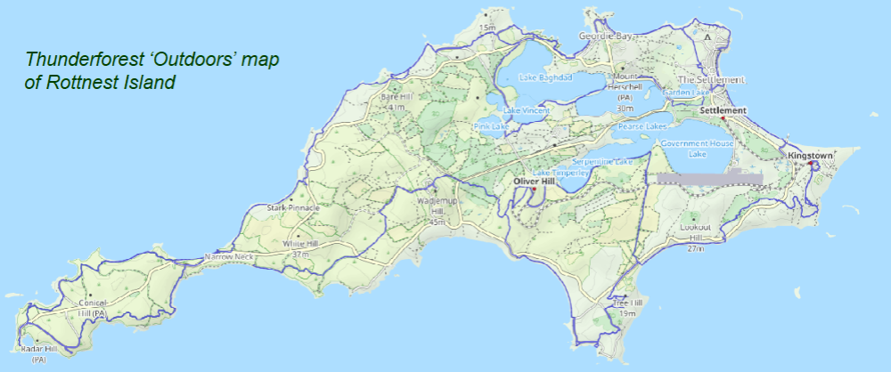

<style type="text/css">
  body{
  font-size: 12pt;
}
</style>

```{r addimg function, include=FALSE}
library(png)
addImg <- function(obj, x = NULL, y = NULL, width = NULL, interpolate = TRUE){
  if(is.null(x) | is.null(y) | is.null(width)){stop("Must provide args 'x', 'y', and 'width'")}
  USR <- par()$usr ; PIN <- par()$pin ; DIM <- dim(obj) ; ARp <- DIM[1]/DIM[2]
  WIDi <- width/(USR[2]-USR[1])*PIN[1] ;   HEIi <- WIDi * ARp 
  HEIu <- HEIi/PIN[2]*(USR[4]-USR[3]) 
  rasterImage(image = obj, xleft = x-(width/2), xright = x+(width/2),
            ybottom = y-(HEIu/2), ytop = y+(HEIu/2), interpolate = interpolate)
}
```

```{r save-default-par, include=FALSE}
defpar <- par(no.readonly = TRUE)
```

<div style="border: 2px solid #039; background-color: #fec; padding: 8px;">
### Video presentations - R graphics

<a href="https://echo360.net.au/media/19219e47-b5fb-44d9-b4f5-8572f9cfc021/public" target="_blank" rel="noopener">&nbsp; {align="left" alt="Video link icon" style="border: 0px solid #000000;" height="38" width="48"}&nbsp;<strong style="font-family: 'Source Sans Pro'; text-shadow: none !important; letter-spacing: normal; margin: 0px; padding: 0px; border: 0px; outline: 0px; font-weight: bold; font-style: normal; font-size: 13px; color: #000080; font-variant-ligatures: normal; font-variant-caps: normal; orphans: 2; text-align: left; text-indent: 0px; text-transform: none; white-space: normal; widows: 2; word-spacing: 0px; -webkit-text-stroke-width: 0px; text-decoration-style: initial; text-decoration-color: initial;"><span style="font-size: 12pt;">Video 1 - basic R/RStudio graphics functions</span></strong></a><br />&nbsp;&nbsp;Duration: 18m48s

<p><span style="color: #000080;"><strong><span style="font-size: 12pt;">&nbsp;<a href="https://echo360.net.au/media/84f872ea-6859-4a3c-a689-4bca0b94a247/public" target="_blank" rel="noopener">{align="left" alt="Video link icon" style="border: 0px solid #000000;" height="38" width="48"}&nbsp;Video 2 - additional R/RStudio graphics functions</a></span></strong></span></p>
<p>&bull;&nbsp;0.00s - 8m47s PowerPoint Presentation<br />&bull;&nbsp;8m59s Setting R graphics parameters using <span style="font-family: consolas, courier new, courier;">par()</span><br />&bull;&nbsp;19m30s Cumulative Distribution Function plots <span style="font-family: consolas, courier new, courier;">plot.ecdf()</span><br />&bull;&nbsp;21m48s Normal quantile (Q-Q) plots using <span style="font-family: consolas, courier new, courier;">qqPlot()</span> from <b><i>car</i></b> package<br />&bull;&nbsp;23m19s Histograms - additional customisations<br />&bull;&nbsp;25m35s Boxplots - additional customisations<br />&bull;&nbsp;27m27s Scatter Plots - more customisation...<br />&bull;&nbsp;31m27s Scatter plot matrices<br />&bull;&nbsp;35m20s Maps (a preliminary look, including use of the `text()` function in graphs</p>
</div>

<p>&nbsp;</p>

<div style="border: 2px solid #039; background-color: #fec; padding: 8px;">
### Files to download for R Graphics

<a href="https://lms.uwa.edu.au/bbcswebdav/pid-3577359-dt-content-rid-24053058_1/xid-24053058_1"><span style="font-size: 12pt;">{alt="R code icon" style="border: 0px solid #000000;" height="32" width="32"}&nbsp;R code (script) file for R Graphics video 1</span></a> &nbsp; &nbsp; <a href="https://lms.uwa.edu.au/bbcswebdav/pid-3577359-dt-content-rid-23693508_1/xid-23693508_1" target="_blank" rel="noreferrer noopener"><span style="font-size: 12pt;">{alt="CSV icon" style="border: 0px solid #000000;" height="32" width="32"}&nbsp;Hubbard Book soil dataset (required in code for video 1 and&nbsp; pdf)</span></a>

<a href="https://lms.uwa.edu.au/bbcswebdav/pid-3577359-dt-content-rid-23693660_1/xid-23693660_1" target="_blank" rel="noreferrer noopener"><span style="font-size: 12pt;">{alt="CSV icon" style="border: 0px solid #000000;" height="32" width="32"}&nbsp;sv18 dataset (required in code for video 2)</span></a> &nbsp; &nbsp; <span style="font-size: 12pt;"><a alt="" href="https://lms.uwa.edu.au/bbcswebdav/pid-3577359-dt-content-rid-45035953_1/xid-45035953_1" target="_blank" rel="noopener">{alt="CSV icon" style="border: 0px solid #000000;" height="32" width="32"}&nbsp;SL18.csv</a><br />used in Annotated code</span>

<span style="font-size: 12pt;"><a href="https://lms.uwa.edu.au/bbcswebdav/pid-3577359-dt-content-rid-45035961_1/xid-45035961_1" target="_blank" rel="noopener">{alt="CSV icon" style="border: 0px solid #000000;" height="32" width="32"}&nbsp;sv2017_original.csv</a> &nbsp; &nbsp; <span style="font-size: 12pt;"><a href="https://lms.uwa.edu.au/bbcswebdav/pid-3577359-dt-content-rid-45035966_1/xid-45035966_1" target="_blank" rel="noreferrer noopener"> <span style="font-size: 12pt;">{alt="R code icon" style="border: 0px solid #000000;" height="32" width="32"}&nbsp;Complete R code (script) used in video</span>&nbsp;2</a></span><br />(just in case!)</span>

<a href="https://lms.uwa.edu.au/bbcswebdav/pid-3577359-dt-content-rid-45035853_1/xid-45035853_1" target="_blank">{alt="R code icon" style="border: 0px solid #000000;" height="32" width="32"}&nbsp;R code for adding mean symbols to boxplots</a> <span style="color: #ff0000; font-size:10pt">(worth trying!)</span>
</div>

<p>&nbsp;</p>

<div style="border: 2px solid #039; background-color: #fec; padding: 8px;">
### Suggested Activities
<span style="color: #800000;"><strong>Using data previously provided (on LMS), produce presentation quality graphs of</strong></span>:

- Different probability distributions</span>
    - Cumulative distribution function, histogram, Q-Q plot
- Scatterplots
    - Grouped by one or more factors
- Histogram, Q-Q plot, Boxplot
- A scatterplot matrix <br />`require(car)` then `scatterplotMatrix()`
    - (grouped by one or more factors)
- Apply principles of graphical excellence

### Useful tips for excellent graphs:

- Increase the default text and symbol sizes
- Remove unnecessary lines (smooth, spread)
- In R Studio, click on <br />Export/Copy to clipboard...<br />and select ◉ Metafile, then click [Copy plot]
<br />(best pasting into Word, etc.)
- Graph plus caption should be self-contained
- Transform axes if necessary
- Use appropriate proportions
</div>

<p>&nbsp;</p>

# More basic information on plots in **R**

This is a supplement to the other preliminary material on **R** graphics. We
have tried to avoid too much overlap with other sessions.
<span style="background-color: #ff0; font-size: 14pt;">If you want instructions
on making the same plots using the `ggplot2` **R** package, 
[go to **this page**](plots-GG.html)</span>.

<iframe height="420" width="640" allowfullscreen frameborder=0 src="https://echo360.net.au/media/84f872ea-6859-4a3c-a689-4bca0b94a247/public?autoplay=false&automute=false"></iframe>

<div style="border: 2px solid #039; background-color: #e8e8e8; padding: 8px;">
## Graphical Excellence

<span style="font-size: 14pt; background-color:#FFFF80;">In Environmental 
Science at UWA we try to promote the principles of "**graphical excellence**". 
This means:</span>

* **Show the data** &ndash; <span style="font-size:10pt; color:#404040;">that is, the data are the important thing we want to communicate in graphics; "looking good" is only useful if it shows the data better!</span>.
* Give your viewer the **greatest number of ideas** in the **shortest time** with the **least ink** in the **smallest space** (Tufte,&nbsp;1983)^1^
* Graphical excellence is
    - almost always **multivariate**...
    - ...requires **telling the truth** about the data <span style="font-size:10pt; color:#404040;">(no distortions, fair comparisons, *etc*.)</span>.
    
**Some practical tips**:

- Increase the default text and symbol sizes 
- Remove unnecessary lines (*e.g*. `smooth`, `spread` in `car::scatterplot()`)
- In RStudio, use the Export▾ button » Copy to clipboard » select &#9673;Metafile (best pasting into Word, *etc.*)
- **Don't** use screen shots, and avoid `.jpg` files, as both can be blurry or grainy
- Graph plus caption should be self-contained &ndash; we should only need to refer to these to fully understand the graph
- **Don't** include a title above the plot (in many **R** plots, use the option `main=""`) &ndash; any information describing the plot should be in the caption
- Transform axes if necessary (using arguments in **R** plotting functions)
- Use appropriate proportions (width/height) for the plot you are creating
- Change the default colour palette to a colourblind-friendly palette, *e.g*. from the **R** packages `viridis` or `scico` (see examples [for viridis here](https://cran.r-project.org/web/packages/viridis/vignettes/intro-to-viridis.html#the-color-scales){target="_blank"} and [for scico here](https://repec.sowi.unibe.ch/stata/palettes/colors.html#scico){target="_blank"})
    
<span style="font-size:10pt">^1^ Tufte, E.R., 1983. *The visual display of quantitative information*. Graphics Press, Cheshire, Connecticut, USA.
</span>
</div>

<p>&nbsp;</p>

<div style="border: 2px solid #039; padding: 8px;">
## Colours in R

The `palette()` function needs a vector of colour
names or codes, which we can then refer to by numbers in subsequent functions.
**R** has over 600 built-in colours, some with nifty names like 
<span style="font-family:monospace; background-color:#deb887;">&quot;burlywood&quot;</span>, 
<span style="font-family:monospace; background-color:#1e90ff; color:white;">&quot;dodgerblue&quot;</span>, 
and <span style="font-family:monospace; background-color:#d8bfd8;">&quot;thistle&quot;</span> 
&ndash; to see these, run the function `colors()` or run `demo("colors")`.

Colour codes are a character string with 6 or 8 digits or letters after the `#`
symbol, like `"#A1B2C3"`. In the 6-digit version (the most common), the first 2 
characters after `#` are a hexadecimal number specifying the intensity of the
<span style="color:white; background-color:red;">&nbsp;red&nbsp;</span> 
component of the colour, the next 2 specify 
<span style="background-color:#00FF00;">&nbsp;green&nbsp;</span>, and the next 2
<span style="color:white; background-color:blue;">&nbsp;blue&nbsp;</span>. **<span style="font-family:monospace; background-color:#E8E8E8;">#<span style="color:red;">rr</span><span style="color:#00C000;">gg</span><span style="color:blue;">bb</span></span>**

The greatest 2-digit hexadecimal number is `FF`, equal to the decimal number
255. Since we can include zero, this means there will be 256^3^ = 16,777,216
unique colours in **R**.

Optionally we can use an 8-character colour code, such as `"#A1B2C399"`, where
the last 2 characters define the **alpha** value, or colour transparency.
`"#rrggbb00"` would be fully transparent, and `"#rrggbbFF"` would be fully
opaque. We can also use the colour name `"transparent"` in **R** which can
sometimes be useful.

<span style="font-size: 14pt;">**Warning**</span>: semi-transparent colours
(*i.e*. alpha < 1; anything other than `"#rrggbb"` or `"#rrggbbFF"`) are
not supported by metafiles in R. To use semi-transparent colours, save as `.png`
or `.tiff`, or copy as a bitmap.
</div>

<p>&nbsp;</p>

## Getting started

Before we start we load some **packages** (which we need to have installed
previously).  We also need to load a **dataset** that we may have seen before
(the Smith's Lake & Charles Veryard Reserves data from 20217 &ndash; we
use it a lot for illustrating environmental statistics and plotting).

```{r load-packages-invisibly, message=FALSE, warning=FALSE, include=FALSE}
library(car)      # scatterplot() and scatterplotMatrix() functions
library(viridis)  # colourblind-friendly colour palettes
library(scico)    # 'scientific' colour palettes
```

```{r read-sv2017, message=FALSE, warning=FALSE, results='hold'}
library(car)      # scatterplot() and scatterplotMatrix() functions
library(viridis)  # colourblind-friendly colour palettes
library(scico)    # 'scientific' colour palettes
git <- "https://github.com/Ratey-AtUWA/Learn-R/raw/main/"
sv2017 <- read.csv(file=paste0(git,"sv2017_original.csv"), stringsAsFactors = TRUE)
sv2017$Group <- as.factor(sv2017$Group)
```

We then make an *xy*-plot (Figure 1) using the `scatterplot()`
function from the `car` package, first setting graphics output parameters with
`par()` and making a custom palette with `palette()`.

<p>&nbsp;</p>

```{r sp-1, fig.height=5, fig.width=5, fig.cap="Figure 1: Scatterplot of Ca vs. pH from the sv2017 dataset, made using `car::scatterplot()` after setting graphics parameters and colour palette.", message=FALSE, warning=FALSE}
require(car)
# adjust overall plot appearance using options within par()
# mar sets plot margins, mgp sets distance of axis details from axis
par(font.lab=2, mar=c(4,4,1,1), mgp=c(2.2,0.7,0.0))
# create custom palette with nice colours :)
palette(c("black",viridis::plasma(4)))
# draw scatterplot with customised options
# pch sets plot character (symbol); cex sets symbol/font sizes
scatterplot(Ca~pH | Type, data=sv2017, log="y", smooth=FALSE,
            legend = list(coords="topleft"), col=c(4,2,1), 
            pch=c(16,0,17), cex=1.5, cex.lab=1.5, cex.axis=1.2)
```

<p>&nbsp;</p>
<div style="border: 2px solid #039; background-color:#e8e8e8; padding: 8px;">

### Plot symbols

**R** has a set of 26 built-in plotting symbols which can be specified using the 
`pch = ` argument in many plotting functions. For symbols 0-20 the colour is set
using the argument `col =`. For symbols 21-25 `col =` sets the border colour,
and the fill colour is set with `bg =`.

```{r pch-map-png, fig.height=3, fig.width=19.2, message=FALSE, warning=FALSE, echo=FALSE}
x <- rep(1:13,2)
y <- rep(seq(2,1,-1),each=13)
par(mar=c(1,1,1,1), lend="square", ljoin="mitre")
plot(x, y,
     pch=0:25,xlim=c(0.5,13.5),ylim=c(0.5,2.5),col="navy",bg="gold", lwd=3,
     xaxt="n",xlab="",yaxt="n",ylab="", cex=6, bty="n")
text(x, y, labels=0:25, cex=3, pos=2, offset = 2)
```
<center>For all symbols above, `col="navy"` and for pch 21-25 `bg="gold"`.</center>
</div>

<p>&nbsp;</p>

### histogram with density line

We have seen a modified boxplot similar to that in Figure
2 before. Adding a density line to a histogram can
help us identify *bimodal distributions*, or see more easily if the distribution
is symmetrical or not.

```{r histogram-density, fig.height=5, fig.width=6, fig.cap="Figure 2: Histogram of EC from the sv2017 data with density line plot added.", message=FALSE, warning=FALSE}
# plot histogram with custom scale and y-axis limits
with(sv2017, hist(log10(EC), freq=F, breaks=15, col="gray", ylim=c(0,2), main=NA))
# add density plot overlay onto histogram
lines(density(log10(sv2017$EC), na.rm=TRUE), col="blue")
```

<hr style="height: 1px; background-color: #5560A4;" />

### Boxplot by groups

We also made a grouped box plot like the one in Figure 3 in a previous session.

```{r boxplot-by-groups, fig.height=5, fig.width=7, fig.cap="Figure 3: Boxplot of Cu by Type, showing means, in the sv2017 data."}
# set up overall plot parameters with par()
par(mar=c(4,4,1,1), mgp=c(2.2,0.7,0),
    font.lab=2, lend="square", ljoin="mitre")
# make an object containing a table of means
Cu_means<-tapply(log10(sv2017$Cu), sv2017$Type, mean, na.rm=T)
# plot the boxplot with nice axis titles etc.
boxplot(log10(sv2017$Cu) ~ sv2017$Type, id.method="y",
        col=c("skyblue","tan","grey"), id.n=0,
        xlab="Sample Type", cex=1.4, cex.lab=1.4, cex.axis=1.3, 
        ylab=expression(bold(paste(log[10],"(Cu, mg/kg)"))))
# plot the means as a symbol 
points(Cu_means, col="blue", pch=3, cex=1.5, lwd=2)
# optionally add a horizontal line to represent some 
# threshold or guideline value(s)
abline(h=log10(65), col="red", lty=2)
# add a legend (especially if a threshold line was added!)
# Note use of \n to add a line break
legend("bottomright",legend=c("Mean","ISQG-Low:\nCu 65 mg/kg"),
       pch=c(3,3), pt.cex=c(1.5,0), pt.lwd=c(2,-1), cex=1.,
       col=c("blue","red"),lty=c(-1,2),lwd=c(-1,2), bty="n", 
       seg.len=2.5, inset=0.03, x.intersp = 0.5)
# delete the object containing the table of means
# (to keep your R workspace tidy)
rm(Cu_means)
```

<hr style="height: 1px; background-color: #5560A4;" />

### Scatterplot of water sample points by group

First read the water data (from Smith's Lake, North Perth, sampled in 2018):

```{r}
SL_water <- read.csv(file=paste0(git,"SL18.csv"), stringsAsFactors = TRUE)
SL_water$Group <- as.factor(SL_water$Group)
```

We can then use `scatterplot()` from the `car` package to plot the points. 
Important arguments in the `scatterplot()` function in this example are:

- `regLine = FALSE` to *not* plot regression lines for the points
- `smooth = FALSE` to *not* plot smoothed curves for the points
- `asp = 1` sets the plot aspect ratio to 1 so the geometry is not distorted (this is important for anything resembling maps!)
- `legend = list(...)` to set legend position, size, *etc*.
- `pch = c(...)` to select specific symbols for each group of points

We also define the colour palette to be used; `viridis::` specifies the package
to use without actually loading it, so we can use the function `viridis(n)`,
which gives a palette of `n` **colourblind-friendly** colours<br>
(In general we can run `packageName::function()` without explicitly loading packages.)


```{r water-scatterplot, fig.height=6, fig.width=6, fig.cap="Figure 4: Plot of water sample locations in Smith's Lake in 2018 made using `car::scatterplot()`.", message=FALSE, warning=FALSE}
# define the colour palette to choose plot colours from
palette(c("black", viridis::viridis(9)))
carPalette(palette())
# note the asp=1 option constrains the height/width ratio
scatterplot(Northing ~ Easting | Group,
            regLine = FALSE,
            smooth = FALSE,
            boxplots = FALSE,
            cex = 1.25,
            cex.axis = 1.2,
            cex.lab = 1.3,
            data = SL_water,
            asp = 1,
            lwd = 2,
            legend = list(coords="topright", cex=1.25),
            pch = c(0,1,2,5,6,15,16,17,18,7,9,10),
            xlab = "Easting UTM Zone 50 (m)",
            ylab = "Northing UTM Zone 50 (m)",
            main = "Smith's Lake Water Sample Locations 2017",
            cex.main = 0.7
)
text(
  c(391380, 391390),
  c(6466498, 6466405),
  labels = c("Inlet", "Outlet"),
  pos = 2,
  col = c(2, 5)
)
```

<hr style="height: 1px; background-color: #5560A4;" />

### 'base **R**' plot of water sample points by group

We can reproduce Figure 4 made using 
`car::scatterplot()` in base-**R** graphics as well:

```{r baseR-water-plot, fig.height=6, fig.width=6, fig.cap="Figure 5: Plot of water sample locations in Smith's Lake in 2018 made using base-R graphics.", message=FALSE, warning=FALSE}
# set up overall plot parameters with par()
# font.lab=2 makes axis titles bold
# 'lend' sets line end style, 'ljoin' sets line join style
par(
  mar=c(4,4,1,1),
  mgp=c(2.2,0.7,0),
  font.lab=2,
  lend="square",
  ljoin="mitre"
)
# define the colour palette to be used
# viridis:: specifies the package to use without actually loading it, so
# we can use viridis(n) which gives a palette of n colourblind-friendly colours
palette(c("black", viridis::viridis(8)))
# plot the points, separating by the factor 'Group'
# note the asp=1 option constrains the height/width ratio
plot(SL_water$Northing ~ SL_water$Easting,
     cex = 1.3,
     cex.axis = 1.2,
     cex.lab = 1.3,
     asp = 1,
     lwd = 1,
     pch = c(21:25,21:24)[SL_water$Group], # better plot symbols!
     bg = c(1:9)[SL_water$Group],          # fill colour for pch 21-25
     xlab = "Easting UTM Zone 50 (m)",
     ylab = "Northing UTM Zone 50 (m)",
     main = "Smith's Lake Water Sample Locations 2017",
     cex.main = 0.7
)
# add a grid (optional)
grid()
# draw the legend to identify groups by symbol/colour
# note similar usage of cex, pch, etc.
legend(
  "topright",
  title="Group",
  legend=levels(SL_water$Group),
  cex=1.2,
  pch = c(21:25,21:24), # vector for pch= same as for plot
  pt.bg = 1:9,          # fill colour for pch 21-25
  pt.cex=1.3,
  pt.lwd=1,
  box.col="grey",
  box.lwd=2,
  inset=0.02
)
# add some text at appropriate coordinates
#  vector of x's, vector of y's, vector of text labels, etc.
text(
  c(391380, 391390),
  c(6466498, 6466405),
  labels = c("Inlet", "Outlet"),
  pos = 2,
  col = c(6, 3)
)
```

<p>&nbsp;</p>

The code to make Figure 5 is somewhat more intricate than that for Figure 4, but
base-**R** plotting can give us more control over plot appearance. (Note that we
don't need to have each function argument on a separate line, as we have done in
the previous code block.)

One aspect of this plot, which is probably an advantage, is the use of symbols
with different colour fill and outline (`pch = 21:25`). This means we can make
better use of the lighter colours in gradational palettes such as those
generated by the `viridis` or `scico` packages.

<hr />

> "...when we look at the **graphs of rising ocean temperatures**, rising carbon 
> dioxide in the atmosphere and so on, we know that they are climbing far more 
> steeply than can be accounted for by the natural oscillation of the weather ... 
> What people (must) do is to change their behavior and their attitudes ... If 
> we do care about our grandchildren then we have to do something, and we have 
> to demand that our governments do something."
>
> &mdash; David Attenborough

<hr />

<h2>Setting up graphics parameters before plotting</h2>

First we read some more data to illustrate some ideas:

```{r}
sv18 <- read.csv(paste0(git, "sv18.csv"), stringsAsFactors = TRUE)
sv18$Group <- as.factor(sv18$Group)
```

### 1. Using *xy*-plots to look at the effect of changing `par()` function arguments

We use the base-**R** function `par()` to change graphics parameters like plot 
margins. After using `par()` these stay changed until changed again by running 
`par()` with different arguments. 

For example let's plot an *x-y* plot using the default settings in `par()`:

```{r Ca-pH-baseR, fig.height=5, fig.width=6, fig.cap="Figure 6: Default plot of Ca *vs*. pH.", echo=-1, message=FALSE, warning=FALSE}
par(defpar)
plot(sv18$Ca ~ sv18$pH, log="y")
```

<p>&nbsp;</p>

Now, try changing some graphics options using the `par()` function
and re-running the simple plot

```{r big-labels, fig.height=5, fig.width=6, fig.cap="Figure 7: Plot of Ca vs. pH with plot margins, symbol sizes, and font size and style changed using `par()`."}
par(mar=c(4,4,1,1), mgp=c(1.8,0.7,0), font.lab=2, cex=1.5, cex.axis=1.25, 
    cex.lab=1.5, tcl=0.2)
plot(sv18$Ca ~ sv18$pH, log="y")
```

<p>&nbsp;</p>

This time we adjust the settings in `par()` to plot multiple plots on a page 
using the `mfrow` argument, which needs a two-value vector `c(rows,columns)`.

```{r plot-2x2, fig.height=5, fig.width=6, fig.cap="Figure 8: Plot of Ca, Mg, Na, and Sr vs. pH with multiple plots specified using `par()` and different sub-plot appearances set using arguments in `plot()`.", message=FALSE, warning=FALSE}
par(mfrow=c(2,2), mar=c(4,4,1,1), mgp=c(1.2,0.2,0), 
    font.lab=2, cex=1., cex.axis=.8, cex.lab=1.,
    tcl=0.2)
with(sv18, plot(Ca ~ pH, log="y", pch=0))
with(sv18, plot(Mg ~ pH, log="y", pch=1, col = "red3"))
with(sv18, plot(Na ~ pH, log="y", pch=2, col = "purple"))
with(sv18, plot(Sr ~ pH, log="y", pch=3, col = "blue2"))
```

<p>&nbsp;</p>

### 2. Plots of variable distributions

Cumulative Distribution Function using `plot.ecdf()`. The custom *y*-axis label
explains the plot! <br>
(note use of `\u` to insert a Unicode character by its 4-digit code 
[Unicode character 2264 is 'less than or equal to' (&le;)] )

```{r ecdfPlot-pH, fig.height=5, fig.width=6, fig.cap="Figure 9: Cumulative distribution of pH in the sv18 dataset.", message=TRUE, warning=FALSE}
plot.ecdf(sv18$pH, xlab="x = pH", 
          ylab="Proportion of samples with pH \u2264 x", main="") 
```

<p>&nbsp;</p>

A better cumulative plot is the normal quantile or 'q-q' plot
specially transformed axes mean that a normally distributed variable
will plot as a straight line. `qqPlot()` from the `car` package is best;
the plot shows the theoretical line and the 95% confidence range.

```{r qqplot-pH, fig.height=5, fig.width=6,fig.cap="Figure 10: Normal quantile (QQ) plot of soil pH in the sv18 dataset. The values in the output block below are the row numbers for unusual observations, which also appear on the plot."}
require(car)
qqPlot(sv18$pH, 
       xlab="Theoretical normal distribution quantiles",
       ylab="Soil pH")
```

<p>&nbsp;</p>

We can group q-q&ndash;plots by a factor:

```{r qq-byfactor, fig.height=7, fig.width=7, message=FALSE, warning=FALSE}
par(oma=c(1,1,1,1))
with(sv18, qqPlot(Na ~ Type, 
       xlab="Theoretical normal distribution quantiles",
       ylab="Soil pH"))
```

<p>&nbsp;</p>

Here's another customization of **histograms** &ndash; we've seen these in a previous
Workshop. Adding a reference concentration shows what proportion of samples have
concentrations exceeding this value (or not).

```{r hist-abline, fig.cap="Figure 11: Histogram of Zn in the sv18 data, showing a reference concentration added using `abline()` and `text()`."}
with(sv18, hist(log10(Zn), breaks=seq(0.4,3.2,0.2),
     xlab="log10(Zn, mg/kg)", main=""))
    # add a vertical line at a threshold value (e.g guideline)
abline(v=log10(300), lty=2, col="red")
text(log10(300),12, labels = "Zn guideline\n300 mg/kg", 
     pos=4, col="red")
```

<p>&nbsp;</p>

Here's a similar customization of **box plots** &ndash; we've also seen these in a
previous Workshop (the only way to get **complex formatting** in plot axis
labels is to use `expression()` &ndash; this code has an example for a 
**~sub~script** in the *y*-axis label):

```{r plain-boxplot, fig.cap="Figure 12: Boxplot of Zn by sample type in the sv18 data, with complex formatting in the y-axis label using an R `expression()`."}
boxplot(log10(sv18$Zn) ~ sv18$Type, 
     xlab="Sample Type", 
     ylab=expression(bold(paste(log[10],"(Zn, mg/kg)"))), main="")
```
<p>&nbsp;</p>

Let's plot it again with better font size to copy-paste into a report. We use a 
large text size so the plot can be reduced in overall size (*e.g*. to put plots 
side-by-side, or to suit 2-column document formats).

```{r better-boxplot, fig.cap="Figure 13: Modified boxplot of Zn by sample type in the sv18 data, with complex formatting in the y-axis label using an R `expression()`."}
par(mar=c(4,4,1,1), mgp=c(2,0.6,0), font.lab=2)
boxplot(log10(sv18$Zn) ~ sv18$Type, 
        xlab="Sample Type", 
        ylab=expression(bold(paste(log[10],"(Zn, mg/kg)"))), 
        main="",
        cex.axis=1.5, cex.lab=1.5,
        col="moccasin")
    # add a HORIZONTAL line at a threshold value (e.g guideline)
    abline(h=log10(300), lty=2, col="red")
    # label it using text()
    text(1,log10(300), labels="Zn limit 300 mg/kg", 
         cex=1.25, col="red", pos=3)
```

<p>&nbsp;</p>

### 3. Variations on scatter plots

In this sequence of plots we show one way to informatively plot a concentration
*vs*. sediment/soil depth, with depth displayed vertically, and increasing 
downwards, as we would expect in the real world.

```{r lower-upper-depth, fig.cap="Figure 14: Plots of Fe vs. depth measurements in the sv18 data."}
par(mfrow = c(1,2))
plot(sv18$Fe ~ sv18$Depth_lower, pch="-")
plot(sv18$Fe ~ sv18$Depth_upper, pch="+")
```

<p><br>Ideally we would like to plot concentration against *mean depth*, but we can't
use a formula (*i.e*. anything in **R** that uses ` ~ `) in another formula!
...<br> 
...so we change the syntax for the variables in `plot()` to use comma instead 
of `~` to allow us to put a calculation in:</p>

```{r}
plot(((sv18$Depth_upper+sv18$Depth_lower)/2), sv18$Fe)
```

<p>&nbsp;</p>

We could also do this by calculating a new variable, *e.g*.:

```{r, eval=FALSE}
sv18$Depth.mean <- (sv18$Depth_upper+sv18$Depth_lower)/2
```

We would then use the newly-calculated `sv18$Depth.mean` as the variable.

For this type of plot, we would prefer to plot depth on the [more intuitive]
vertical axis

```{r switch-axes, fig.height=6, fig.width=4, fig.cap="Figure 15: Plot of Fe vs. depth with x- and y-axis positions switched (so really it's depth vs. Fe, but we have our reasons).", message=FALSE, warning=FALSE}
plot(sv18$Fe, ((sv18$Depth_upper+sv18$Depth_lower)/2), ylim=c(0,100))
```

<p>&nbsp;</p>

This puts depth in the wrong direction, though, so we use `ylim =` to reverse direction of y axis, by swapping `ylim=c(0,100)` for `ylim=c(100,0)`.

```{r reverse-y, fig.height=6, fig.width=4, fig.cap="Figure 16: Plot of Fe vs. depth with x- and y-axis positions switched and the vertical axis (depth) scale reversed.", message=FALSE, warning=FALSE}
plot(sv18$Fe, ((sv18$Depth_upper+sv18$Depth_lower)/2), ylim=c(100,0))
```

<p>&nbsp;</p>

Now tidy up plot margins, axis labels, *etc*. &ndash; use `help()` to understand the
function arguments for `par()` and `plot()`...

```{r best-par-and-labels, fig.height=6, fig.width=4, fig.cap="Figure 17: Plot of Fe vs. depth with x- and y-axis positions switched, y axis scale reversed, and tidy axis labels.", message=FALSE, warning=FALSE}
par(mar=c(4,4,1,1),
    mgp=c(1.6,0.5,0),
    font.lab=2)
#... and plot it again with nice axis labels
plot(sv18$Fe, ((sv18$Depth_upper+sv18$Depth_lower)/2), ylim=c(100,0), 
     xlab="Fe (mg/kg)", ylab="Mean depth (cm)")
```

<p>&nbsp;</p>

What if we want the horizontal axis 'on top'? We do this by omitting axis 
plotting (*i.e*. `xaxt="n"`) and axis label (`xlab=""`)...<br>
... then plot the *x*-axis manually, first adjusting plot margins so that there 
is more space at the top of the plot and less at the bottom.

```{r x-axis-to-top, fig.height=6, fig.width=4, fig.cap="Figure 18: Plot of Fe vs. depth with x- and y-axis positions switched, y axis scale reversed, tidy axis labels, and x-axis label and ticks at the top.",, echo=-1, message=FALSE, warning=FALSE}
par(font.lab=2)
par(mar=c(1,4,4,1)) # won't change anything except margins
plot(sv18$Fe, ((sv18$Depth_upper+sv18$Depth_lower)/2),
     xlab="", xaxt="n",
     ylim=c(100,0), 
     ylab="Mean depth (cm)")
# two code lines for manual axis plus label
axis(3)
mtext(side=3, line=2.5, font=2, text="Fe (mg/kg)")
```

<p>&nbsp;</p>

<table width="100%" border="1">
<tr><td>**Axis values in R**<br>
In **R** the plot axes have a specific order. For example in the `par()` 
function when setting margins, *e.g*. `mar=c(4,4,1,1)`, the margins are set with a four-value vector. The values of this vector are always in the same order:
`c(bottom, left, top, right)`, that is, clockwise starting from the bottom axis = 1.</td></tr>
</table>

```{r axis-positions, fig.height=3, fig.width=3, fig.cap="", message=FALSE, warning=FALSE, echo=FALSE}
par(mar=c(3,3,3,3)-0.5, cex.lab=1.4)
plot(c(0,1), c(0,1), type="n", xaxt="n",yaxt="n",xlab="",ylab="");box(lwd=2)
text(0.5,0.5,labels="(plot\narea)",cex=1.8,family="mono")
mtext("Bottom axis = 1",1,0.75, cex=1.6)
mtext("Left axis = 2",2,0.75, cex=1.6)
mtext("Top axis = 3",3,0.75, cex=1.6)
mtext("Right axis = 4",4,0.75, cex=1.6)
par(defpar)
```

### 4. Scatterplot matrices

A scatterplot matrix can be a very useful data exploration tool (for the most
effective visualization, you might need to change the default colours).

Scatterplot matrices are available using the `scatterplotMatrix()` function 
(which can be shortened to `spm()`) from the `car` package. 

The most basic implementation is plotting without grouping by a Factor variable.
Note the different way in which the variables (a list starting with `~` and 
separated by `+`) and data frame (`data=`) are specified.  
The smoothed trend through the points can be included by changing the `smooth=`
argument to `smooth=TRUE`.

A very useful feature of scatter plot matrices is the display of each variable's
*distribution along the diagonal* of the plot matrix. In the example in Figure 19, 
we can see that all variables have a positively skewed distribution (which might 
be made more symmetrical by log-transformation).

```{r spm-ungrouped, fig.height=6, fig.width=6, fig.cap="Figure 19: Scatter plot matrix of Al, Ca, Fe, and Na concentrations in sediment + soil + street dust samples from Smith's Lake and Charles Veryard Reserves, North Perth, WA, sampled in 2018."}
require(car)
scatterplotMatrix(~Al + Ca + Fe + Na, data=sv18, smooth=FALSE)
```

<p>&nbsp;</p>

To distinguish the points according to the categories in a Factor variable, the
Factor is included after the list of plotted variables using the `|` operator. We also see the distributions separated by group along the diagonal.

Separating the plots by a factor allows us to see if trends are consistent
between groups, or if groups behave very differently. [If you don't want to
bother with the `scico` package, use `col = c("#EDB256", "#AC4A44", "#191900")`
for the same result.]

```{r spm-by-group, fig.height=6, fig.width=6, fig.cap="Figure 20: Scatter plot matrix of Al, Ca, Fe, and Na concentrations in samples from Smith's Lake and Charles Veryard Reserves, North Perth, WA, sampled in 2018 and grouped by sample type (sediment, soil, or street dust).", message=FALSE, warning=FALSE}
scatterplotMatrix(~Al + Ca + Fe + Na | Type, data=sv18, smooth=FALSE,
                  col=scico::scico(3,palette = "lajolla", begin=0.3), 
                  pch = c(0,1,3), cex=1.4)
```

<p>&nbsp;</p>

Often we can get a better idea of the trends and differences between variables
by transforming variables (log~10~-transformation usually is OK). [If you don't
want to bother with the `scico` package, use 
`col = c("#001959","#426F51","#E09651")` for the same result.]

```{r spm-by-group-log, fig.height=6, fig.width=6, fig.cap="Figure 21: Scatter plot matrix of log-transformed Al, Ca, Fe, and Na concentrations in samples from Smith's Lake and Charles Veryard Reserves, North Perth, WA, sampled in 2018 and grouped by sample type (sediment, soil, or street dust).", message=FALSE, warning=FALSE}
scatterplotMatrix(~log10(Al) + log10(Ca) + log10(Fe) + log10(Na) | Type, 
                  data=sv18, 
                  smooth=FALSE,
                  col=scico::scico(3,palette = "batlow", end=0.7), 
                  pch = c(15,1,3), cex=1.4)
```

<p>&nbsp;</p>

### 5. Simple maps

Maps are [mostly] just scatterplots with a map background &ndash; we will spend 
a separate session on maps in R later.

<center></center>

```{r, eval=FALSE, include=FALSE}
#```{r map-code-hidden, echo=FALSE, fig.align='center', fig.height=4.2, fig.width=9, message=FALSE, warning=FALSE, out.width='80%', results='hold'}
# library(ggmap)
# artStamen2 <- get_stamenmap(bbox=c(left=115.44, bottom = -32.03,
#                                    right = 115.561, top = -31.985),
#                             zoom = 14, 
#                             maptype = "terrain", 
#                             color = "color") 
# ggmap(artStamen2) + 
#   labs(x="Stamen 'terrain' map of Rottnest Island", y = "") +
#   theme(axis.text=element_text(size=1, color="transparent"),
#         axis.title=element_text(size=14, color="dodgerblue", face="italic"),
#         axis.ticks = element_line(colour = "transparent")) 
```

<hr style="height: 1px; background-color: #5560A4;" />

### Pretty palettes

(See the code at the end)

{align="center"}

<p>&nbsp;</p>

> Go to the [`ggplot2` graphics page here](plots-GG.html).

<p>&nbsp;</p>

## References and R Packages

Fox J (2022). *RcmdrMisc: R Commander Miscellaneous Functions*. R package version 2.7-2, [https://CRAN.R-project.org/package=RcmdrMisc](https://CRAN.R-project.org/package=RcmdrMisc){target="_blank"}.

Fox J, Weisberg S (2019). *An {R} Companion to Applied Regression, Third Edition*. Thousand Oaks CA: Sage. [https://socialsciences.mcmaster.ca/jfox/Books/Companion/](https://socialsciences.mcmaster.ca/jfox/Books/Companion/){target="_blank"} (`car` package).

Garnier S, Ross N, Rudis R, Camargo AP, Sciaini M, Scherer C (2021). *Rvision - Colorblind-Friendly Color Maps for R*. R package version 0.6.2. [https://sjmgarnier.github.io/viridis/](https://sjmgarnier.github.io/viridis/){target="_blank"} (`viridis` package).

Pedersen T, Crameri F (2023). *scico: Colour Palettes Based on the Scientific Colour-Maps*. R package version 1.4.0, [https://CRAN.R-project.org/package=scico](https://CRAN.R-project.org/package=scico){target="_blank"}.

<p>&nbsp;</p>

```{r fave-palettes-notrun, eval=FALSE}
# first load and run code to make UWAcolgrad() function
# for help download the UWAcolgrad.R file itself and look inside!
source("https://github.com/Ratey-AtUWA/Learn-R/raw/main/UWAcolgrad.R")
np <- 32
par(mar=rep(0.5,4), xpd=TRUE)
plot(0:1, 0:1, ann=F, axes = F, type="n", ylim=c(-0.1,1))
points(seq(0,1,l=np),rep(1,np),pch=22,bg=viridis(np),cex=4)
text(0.5,0.98,labels=paste0("viridis::viridis(",np,")"),pos=1, cex=1.4, family="mono")
points(seq(0,1,l=np),rep(0.85,np),pch=22,bg=plasma(np),cex=4)
text(0.5,0.83,labels=paste0("viridis::plasma(",np,")"),pos=1, cex=1.4, family="mono")
points(seq(0,1,l=np),rep(0.7,np),pch=22,bg=cividis(np),cex=4)
text(0.5,0.68,labels=paste0("viridis::cividis(",np,")"),pos=1, cex=1.4, family="mono")
points(seq(0,1,l=np),rep(0.55,np),pch=22,bg=scico(np, palette = "hawaii"),cex=4)
text(0.5,0.53,labels=paste0("scico(",np,", palette='hawaii')"),pos=1, cex=1.4, family="mono")
points(seq(0,1,l=np),rep(0.4,np),pch=22,bg=scico(np, palette = "lajolla"),cex=4)
text(0.5,0.38,labels=paste0("scico(",np,", palette='lajolla')"),pos=1, cex=1.4, family="mono")
points(seq(0,1,l=np),rep(0.25,np),pch=22,bg=scico(np, palette = "batlow"),cex=4)
text(0.5,0.23,labels=paste0("scico(",np,", palette='batlow')"),pos=1, cex=1.4, family="mono")
points(seq(0,1,l=np),rep(0.1,np),pch=22,bg=UWAcolgrad(np),cex=4)
text(0.5,0.08,labels=paste0("UWAcolgrad(",np,")"),pos=1, cex=1.4, family="mono")
points(seq(0,1,l=np),rep(-0.05,np),pch=22,bg=UWAcolgrad(np, saturated = TRUE),cex=4)
text(0.5,-0.07,labels=paste0("UWAcolgrad(",np,", saturated=TRUE)"),pos=1, cex=1.4, family="mono")
```

<p>&nbsp;</p>
